# Authentication Flow

Based on Laravel Breeze (`routes/auth.php`) and custom suspension logic in `AuthenticatedSessionController`.

---

## 1. Registration (Presentation)

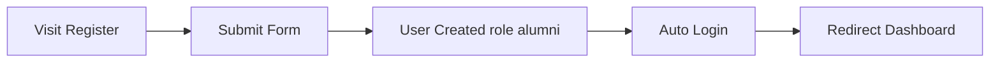

---

## 2. Registration (Technical)

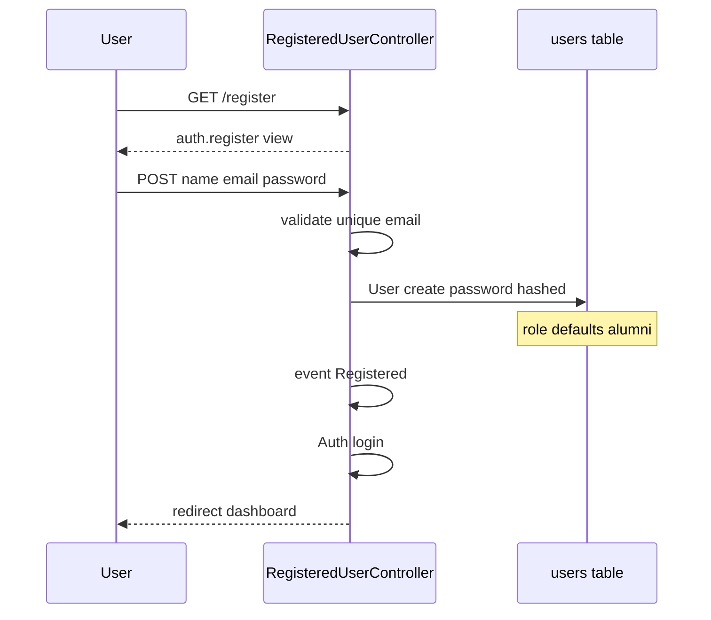

**No alumni_profiles row** created at registration.

---

## 3. Login (Presentation)

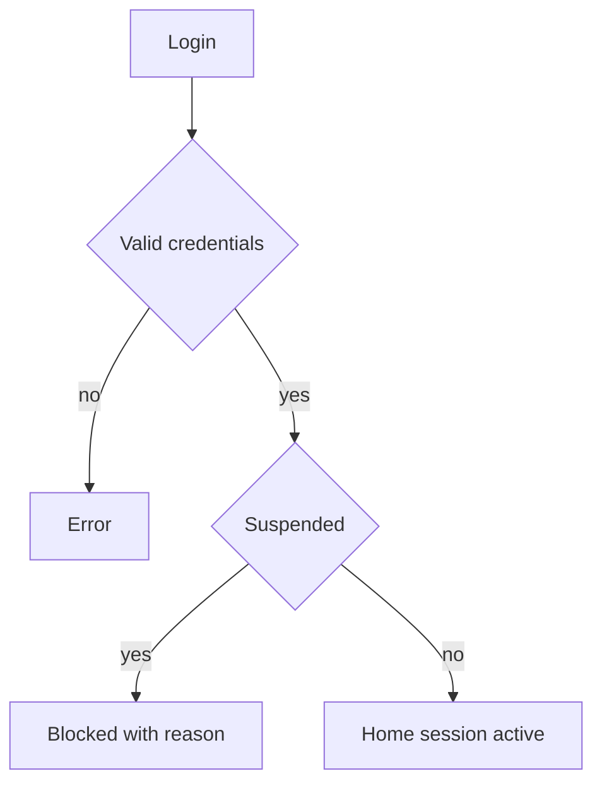

---

## 4. Login (Technical)

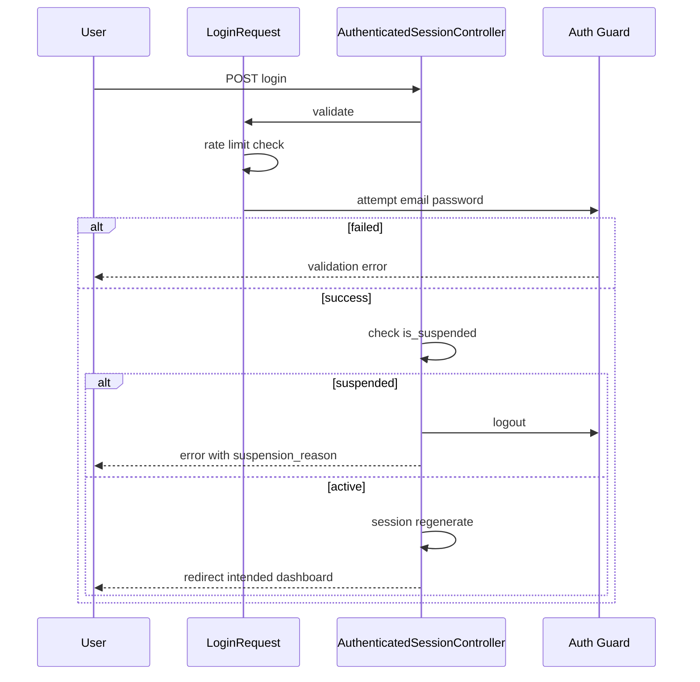

---

## 5. Middleware Protection (Presentation)

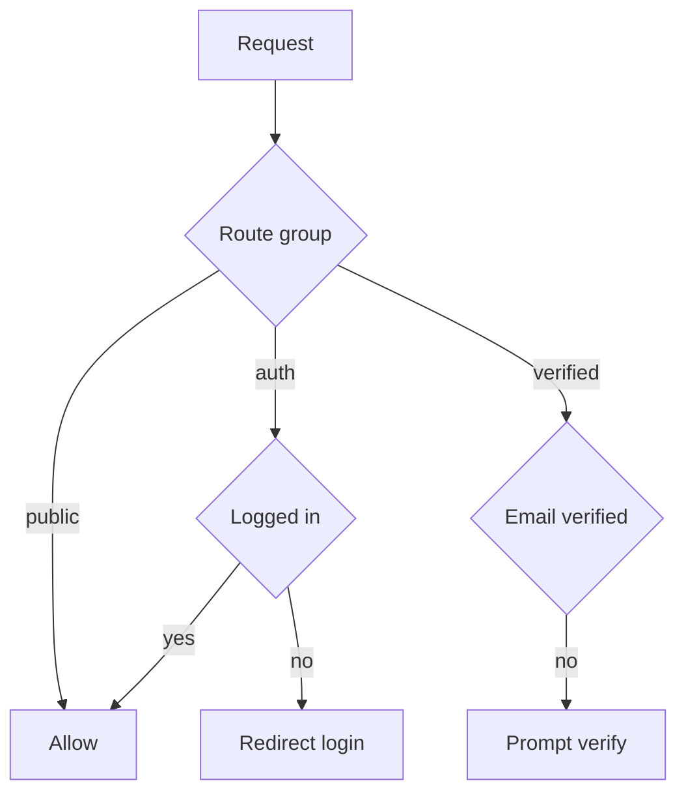

---

## 6. Middleware Protection (Technical)

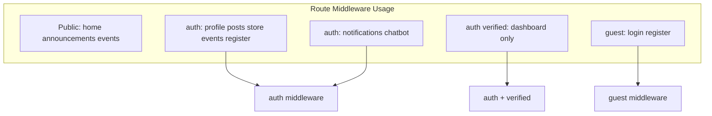

**Gap documented:** `GET /posts/create` has no `auth` middleware (controller checks user).

---

## 7. Session Handling (Presentation)

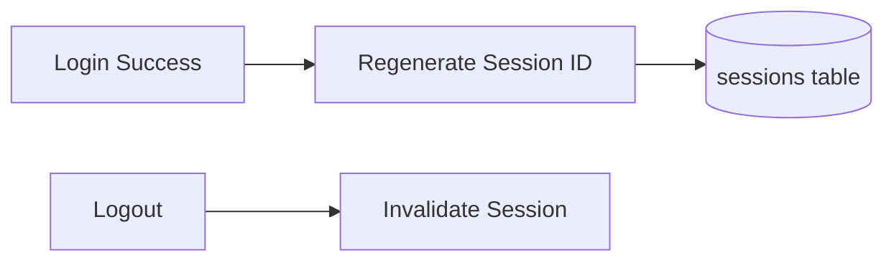

---

## 8. Session Handling (Technical)

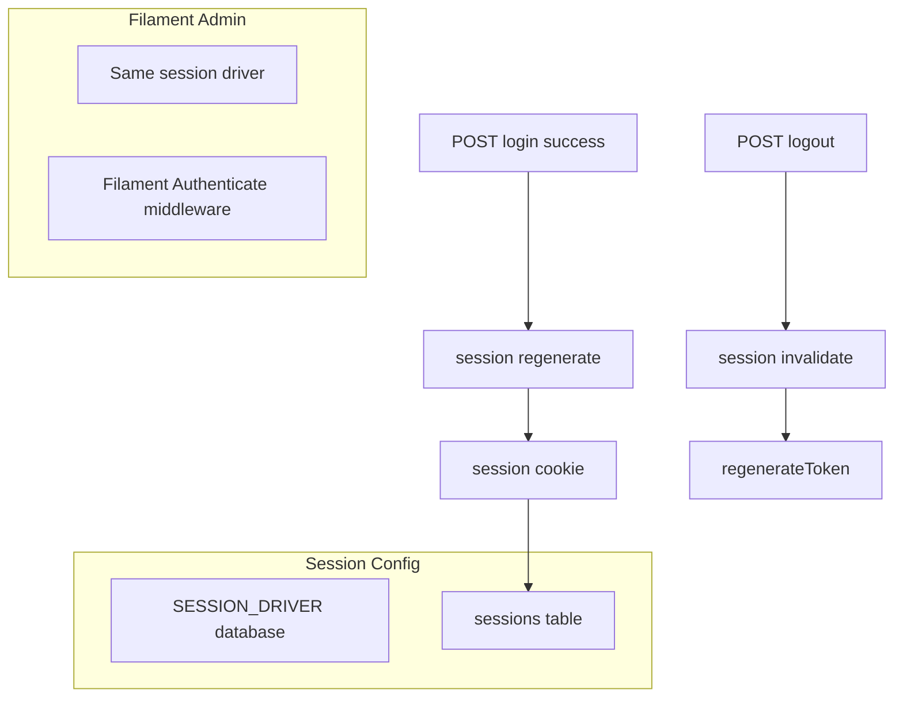

---

## 9. Alumni Verification (Presentation)

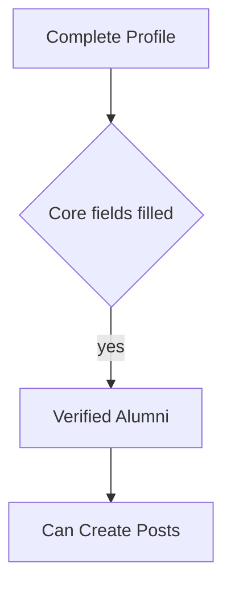

---

## 10. Alumni Verification (Technical)

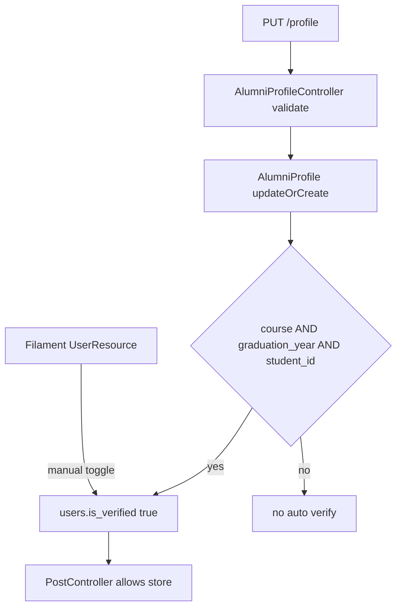

**Distinct from** `email_verified_at` (Breeze email verification).

---

## 11. Suspension Workflow (Presentation)

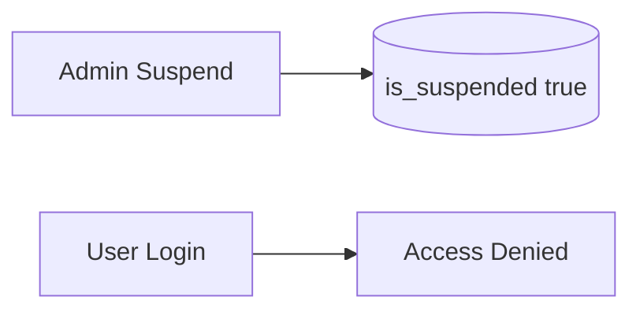

---

## 12. Suspension Workflow (Technical)

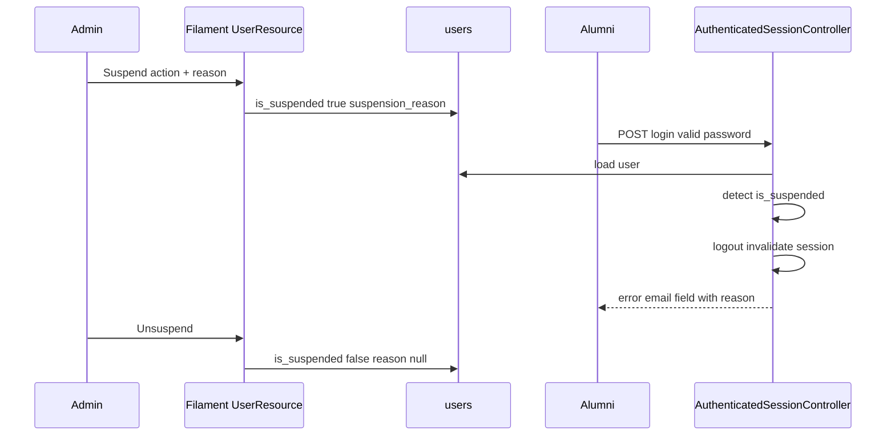

---

## 13. Role Authorization (Presentation)

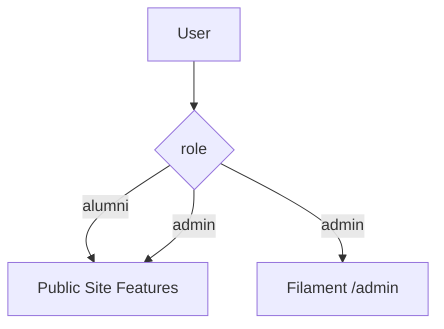

---

## 14. Role Authorization (Technical)

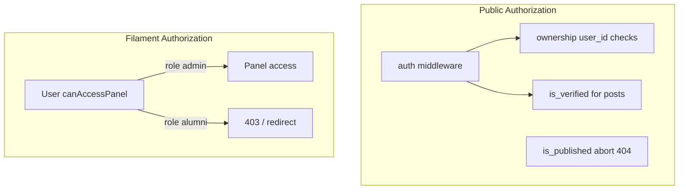

**No Laravel Policies** — inline checks only.

---

## Auth File Reference

| Flow | Primary file |
|------|----------------|
| Register | `RegisteredUserController.php` |
| Login | `AuthenticatedSessionController.php`, `LoginRequest.php` |
| Panel gate | `User.php` `canAccessPanel()` |
| Profile verify | `AlumniProfileController.php` |
| Suspend | `UserResource.php` |
