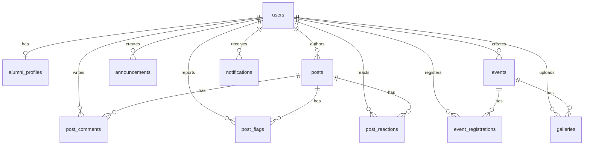
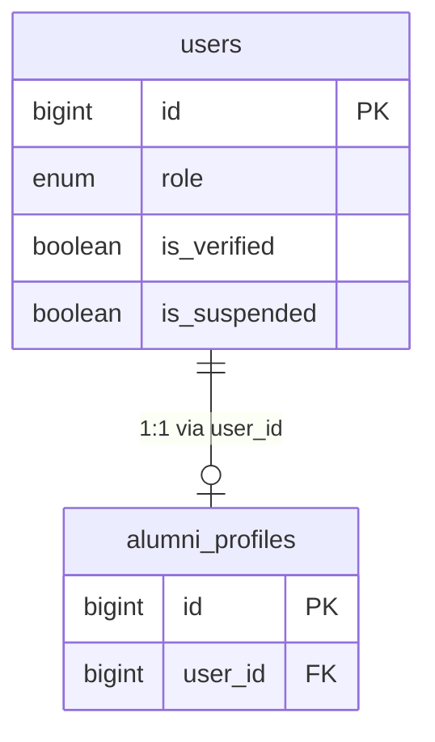
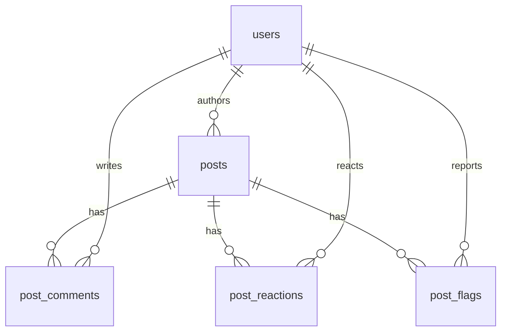
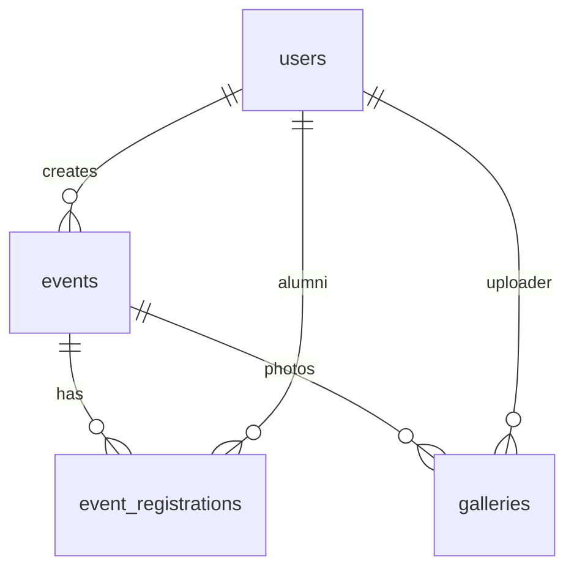

# Database Entity Relationship Diagram

Schema from `database/migrations/` (18 migrations). Laravel infrastructure tables omitted from ERD unless noted.

---

## 1. Core Domain ERD (Presentation)



---

## 2. Core Domain ERD (Technical)

```mermaid
erDiagram
    users {
        bigint id PK
        string name
        string email UK
        timestamp email_verified_at
        string password
        enum role "admin alumni"
        boolean is_verified
        boolean is_suspended
        text suspension_reason
        timestamps created_at updated_at
    }

    alumni_profiles {
        bigint id PK
        bigint user_id FK UK
        string student_id
        string course
        int graduation_year
        string phone
        string address
        string current_job
        string company
        string linkedin_url
        string portfolio_url
        string profile_photo
        text bio
        string skills
        timestamps created_at updated_at
    }

    announcements {
        bigint id PK
        bigint user_id FK
        string title
        text content
        string cover_image
        boolean is_published
        timestamps created_at updated_at
    }

    events {
        bigint id PK
        bigint user_id FK
        string title
        text description
        string location
        datetime event_date
        int slots
        string cover_image
        boolean is_published
        timestamps created_at updated_at
    }

    event_registrations {
        bigint id PK
        bigint event_id FK
        bigint user_id FK
        enum status "pending confirmed cancelled"
        timestamps created_at updated_at
    }

    galleries {
        bigint id PK
        bigint event_id FK
        bigint user_id FK
        string image_path
        string caption
        timestamps created_at updated_at
    }

    posts {
        bigint id PK
        bigint user_id FK
        enum category
        string title
        text body
        enum status "visible hidden removed"
        boolean is_flagged
        string image_path
        timestamps created_at updated_at
    }

    post_comments {
        bigint id PK
        bigint post_id FK
        bigint user_id FK
        text body
        timestamps created_at updated_at
    }

    post_flags {
        bigint id PK
        bigint post_id FK
        bigint user_id FK
        enum reason
        string details
        timestamps created_at updated_at
    }

    post_reactions {
        bigint id PK
        bigint post_id FK
        bigint user_id FK
        enum type "like celebrate support"
        timestamps created_at updated_at
    }

    notifications {
        uuid id PK
        string type
        string notifiable_type
        bigint notifiable_id
        text data
        timestamp read_at
        timestamps created_at updated_at
    }

    users ||--o| alumni_profiles : "user_id CASCADE"
    users ||--o{ announcements : "user_id CASCADE"
    users ||--o{ events : "user_id CASCADE"
    users ||--o{ event_registrations : "user_id CASCADE"
    users ||--o{ galleries : "user_id CASCADE"
    users ||--o{ posts : "user_id CASCADE"
    users ||--o{ post_comments : "user_id CASCADE"
    users ||--o{ post_flags : "user_id CASCADE"
    users ||--o{ post_reactions : "user_id CASCADE"

    events ||--o{ event_registrations : "event_id CASCADE"
    events ||--o{ galleries : "event_id CASCADE"

    posts ||--o{ post_comments : "post_id CASCADE"
    posts ||--o{ post_flags : "post_id CASCADE"
    posts ||--o{ post_reactions : "post_id CASCADE"

    users ||--o{ notifications : "notifiable morph"
```

---

## 3. Users and Profile (Focused)



**Cardinality:** One user has zero or one alumni profile. Profile row created on first `updateOrCreate` from profile edit.

---

## 4. Social Graph (Focused)



**Unique constraints:**

- `post_flags`: one flag per `(post_id, user_id)`
- `post_reactions`: one reaction per `(post_id, user_id)`
- `event_registrations`: one registration per `(event_id, user_id)`

---

## 5. Events and Media (Focused)



**Note:** `event_registrations` is a junction table with status — not pure many-to-many (includes attributes).

---

## 6. Notifications (Focused)

```mermaid
erDiagram
    users ||--o{ notifications : "morph notifiable"

    notifications {
        uuid id PK
        string type
        text data JSON
        timestamp read_at
    }
```

**Implementation:** `PostCommentNotification` only in current codebase.

---

## 7. Indexes (Reference)

| Table | Indexed columns |
|-------|-----------------|
| `posts` | `status`, `category`, `is_flagged` |
| `post_comments` | `post_id` |
| `users` | `email` unique |
| `event_registrations` | unique `(event_id, user_id)` |
| `post_flags` | unique `(post_id, user_id)` |
| `post_reactions` | unique `(post_id, user_id)` |

---

## 8. Relationship Summary Table

| From | To | Type | FK / Notes |
|------|-----|------|------------|
| users | alumni_profiles | 1:0..1 | `user_id` CASCADE |
| users | posts | 1:N | `user_id` CASCADE |
| users | announcements | 1:N | admin author |
| users | events | 1:N | admin creator |
| users | event_registrations | 1:N | alumni attendee |
| users | galleries | 1:N | uploader |
| events | event_registrations | 1:N | |
| events | galleries | 1:N | |
| posts | post_comments | 1:N | |
| posts | post_flags | 1:N | |
| posts | post_reactions | 1:N | |
| users | notifications | 1:N | polymorphic |

**No many-to-many without junction table** except morph `notifications`.

---

## Infrastructure Tables (Not in ERD)

| Table | Purpose |
|-------|---------|
| `sessions` | Database sessions |
| `cache`, `cache_locks` | Cache |
| `jobs`, `job_batches`, `failed_jobs` | Queue (no app jobs yet) |
| `password_reset_tokens` | Auth reset |

See `/docs/DATABASE_SCHEMA.md` for column-level documentation.
