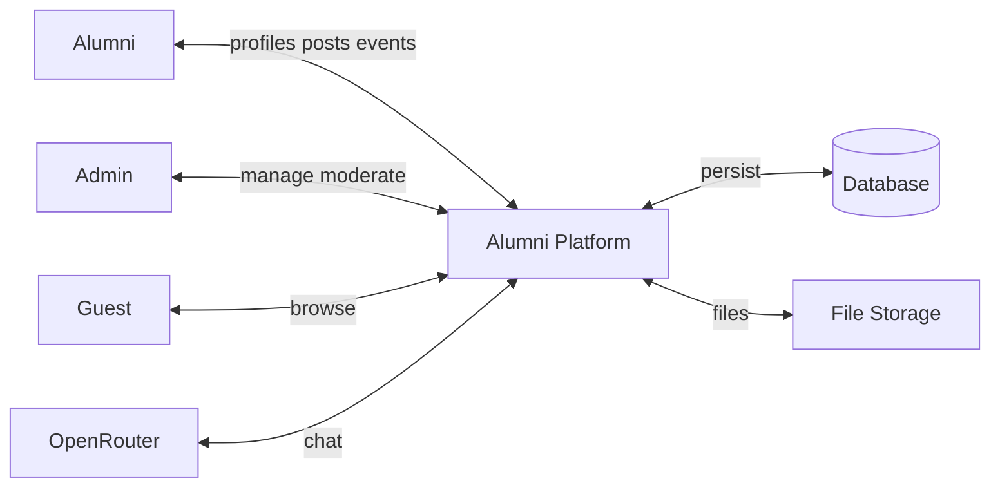
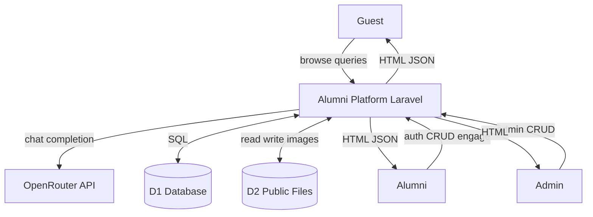
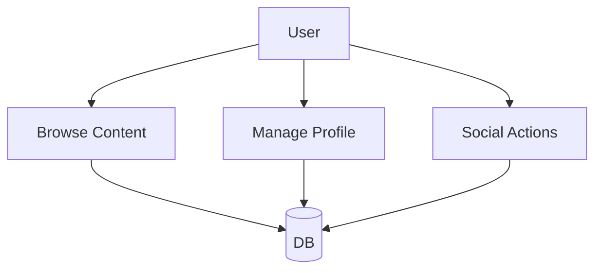
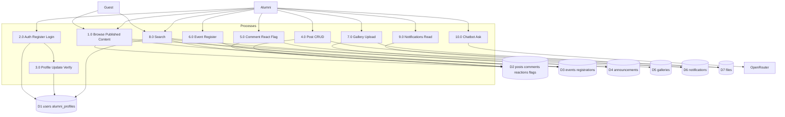
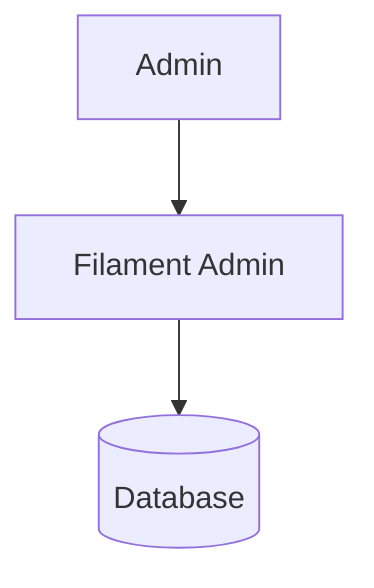
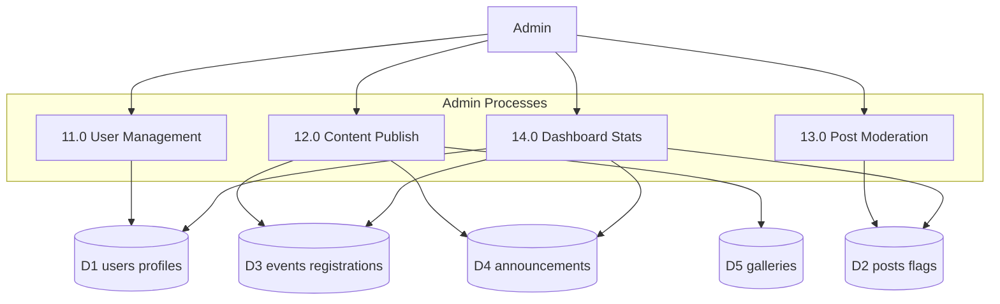
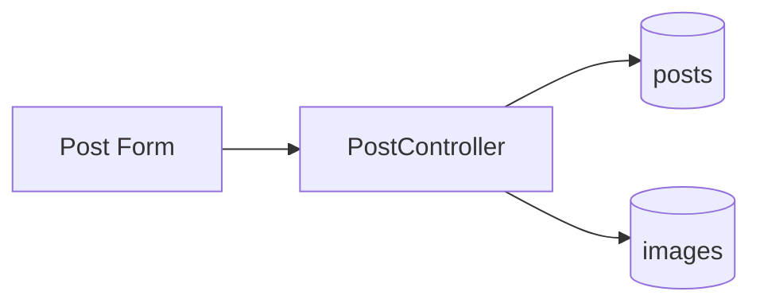
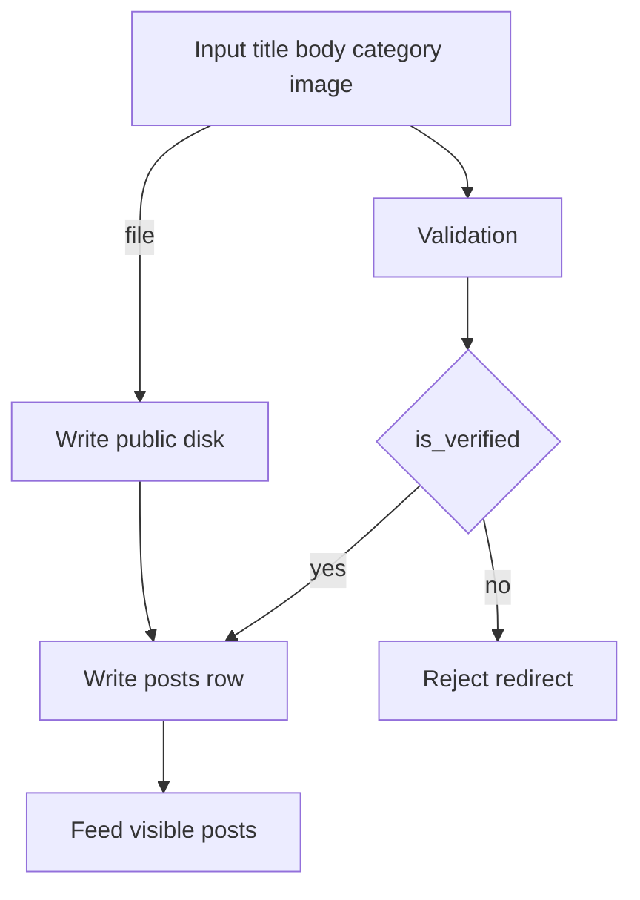
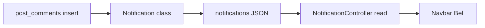
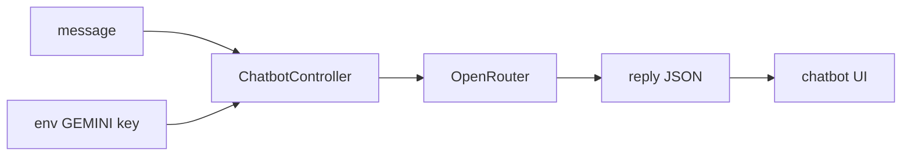

# Data Flow Diagram (DFD)

Level 0 and Level 1 DFDs based on actual data stores and processes. Notation: processes (rounded), data stores (open rectangle), external entities (square).

---

## 1. Context Diagram — Level 0 (Presentation)

---

## 2. Context Diagram — Level 0 (Technical)

---

## 3. Level 1 DFD — Public Site (Presentation)

---

## 4. Level 1 DFD — Public Site (Technical)

---

## 5. Level 1 DFD — Admin (Presentation)

---

## 6. Level 1 DFD — Admin (Technical)

---

## 7. Post Data Flow (Focused — Presentation)

---

## 8. Post Data Flow (Focused — Technical)

---

## 9. Notification Data Flow (Focused)

---

## 10. Chatbot Data Flow (Focused)

**No chat history persisted** in database.

---

## Data Store Summary

| Store | Tables / path | Primary consumers |
|-------|---------------|-------------------|
| D1 Users | users, alumni_profiles | Auth, profile, directory |
| D2 Social | posts, comments, reactions, flags | Feed, moderation |
| D3 Events | events, event_registrations | Events, gallery gate |
| D4 News | announcements | Home, announcements |
| D5 Media | galleries + disk paths | Gallery views |
| D6 Alerts | notifications | Bell, index |
| D7 Files | storage/app/public | All uploads |

See [DATABASE_ERD.md](./DATABASE_ERD.md) for schema detail.
