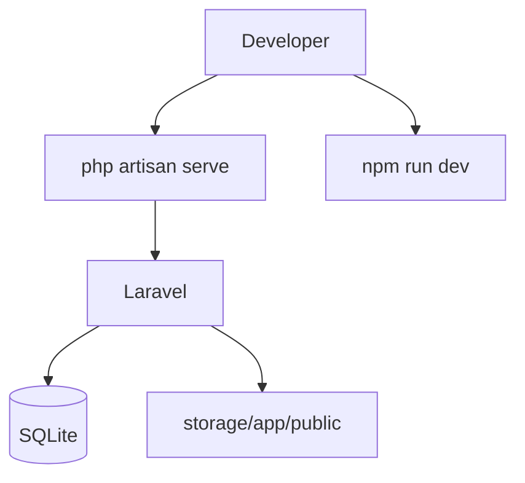
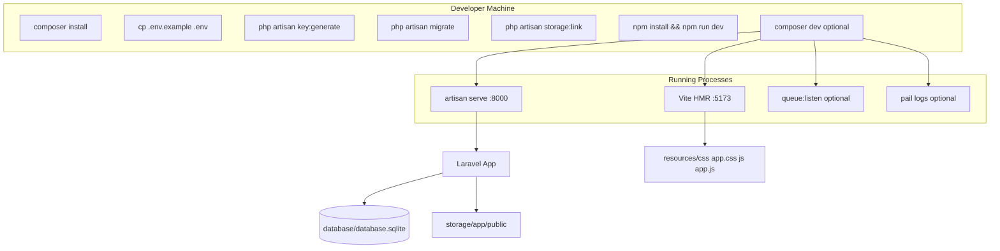
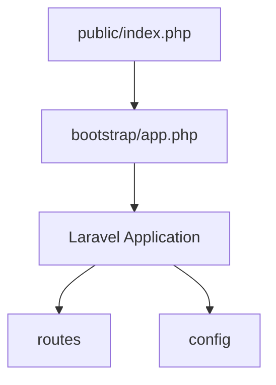
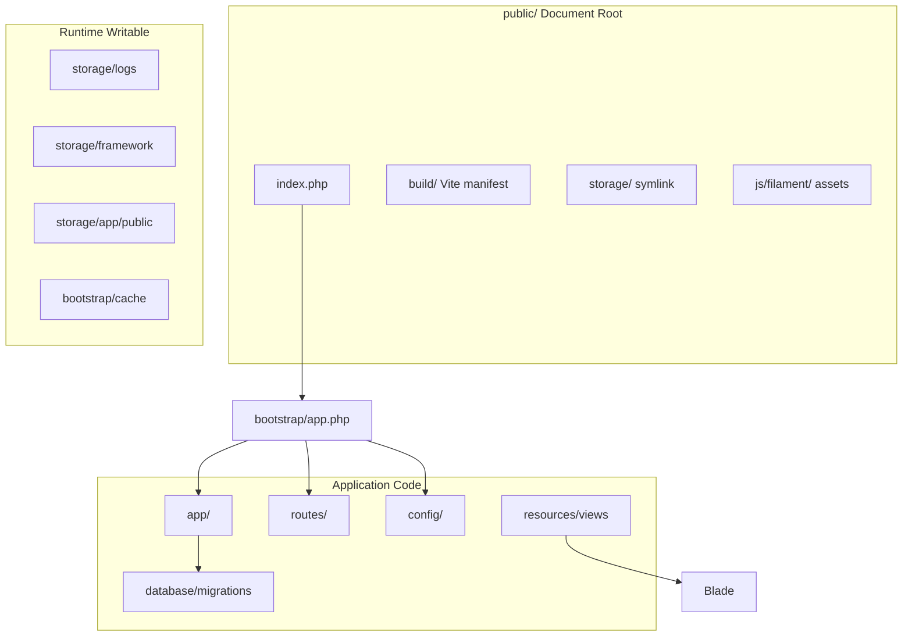
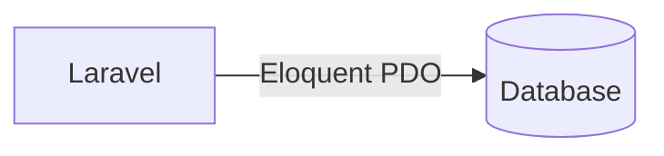
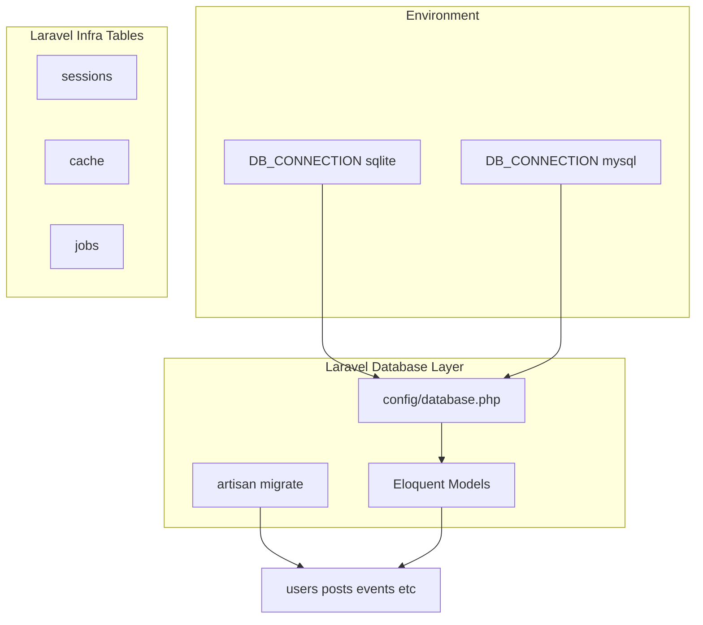
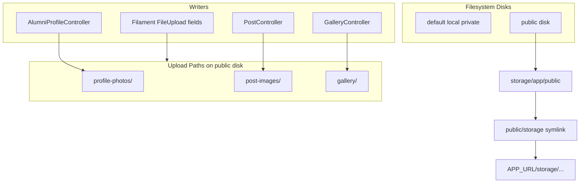
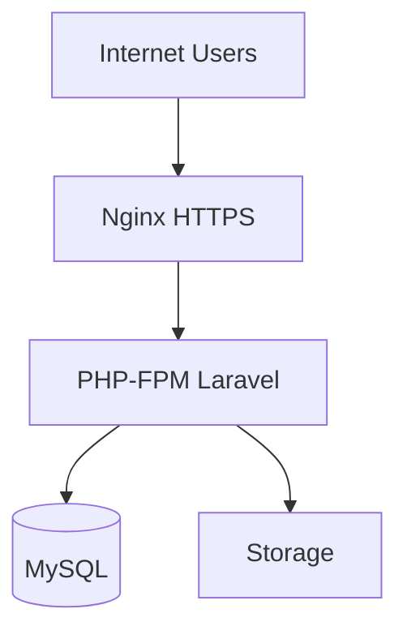
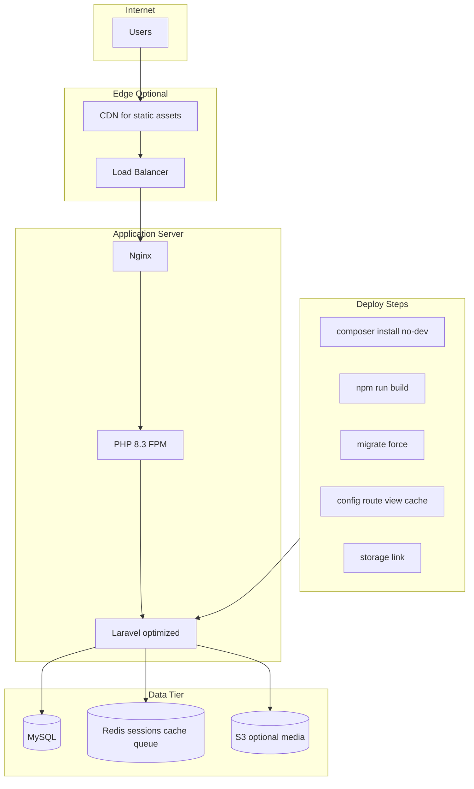
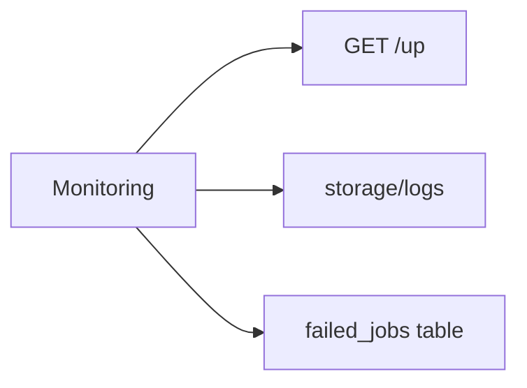

# Deployment Architecture

Based on `composer.json` scripts, `.env.example`, `config/filesystems.php`, and Laravel 13 defaults.

---

## 1. Local Development (Presentation)



---

## 2. Local Development (Technical)



**Composer `dev` script:** concurrently runs serve, queue, pail, vite.

---

## 3. Laravel Server Structure (Presentation)



---

## 4. Laravel Server Structure (Technical)



---

## 5. Database Connection (Presentation)



---

## 6. Database Connection (Technical)



**Testing:** PHPUnit uses `:memory:` SQLite per `phpunit.xml`.

---

## 7. Storage Structure (Presentation)

```mermaid
flowchart TB
    Upload[User Upload] --> Disk[public disk]
    Disk --> Link[storage link]
    Link --> URL[/storage/ URL]
```

---

## 8. Storage Structure (Technical)



**Default `.env.example`:** `FILESYSTEM_DISK=local` (uploads explicitly use `public` disk in code).

---

## 9. Production Deployment (Presentation)



---

## 10. Production Deployment (Technical)



---

## 11. Environment Layers (Reference)

| Layer | Development | Production |
|-------|-------------|------------|
| App URL | localhost:8000 | https://domain |
| Database | SQLite file | MySQL |
| Sessions | database | redis recommended |
| Queue | database sync | redis + supervisor |
| Mail | log | smtp |
| Debug | true | false |
| Chatbot | GEMINI_API_KEY | secrets manager |

---

## 12. Health and Ops



See `/docs/DEPLOYMENT_GUIDE.md` for command checklist.
