# Events and Registration Flow

Controllers: `EventController` (public), `EventResource` / `EventRegistrationResource` (Filament).

---

## 1. Event Lifecycle (Presentation)

---

## 2. Event Lifecycle (Technical)

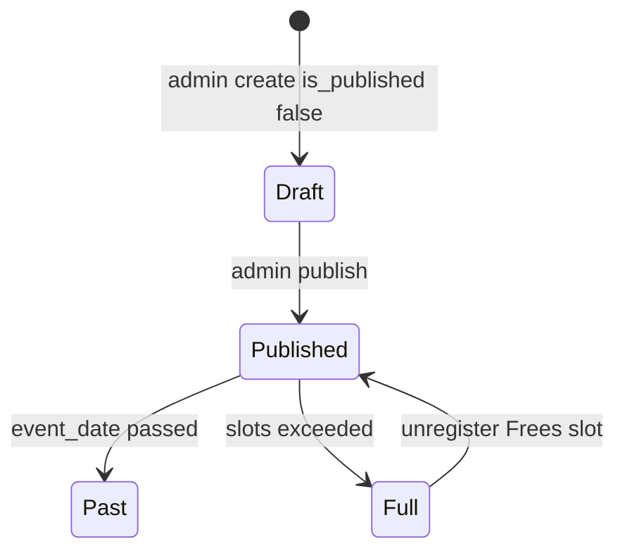

---

## 3. Public Browse Flow (Presentation)

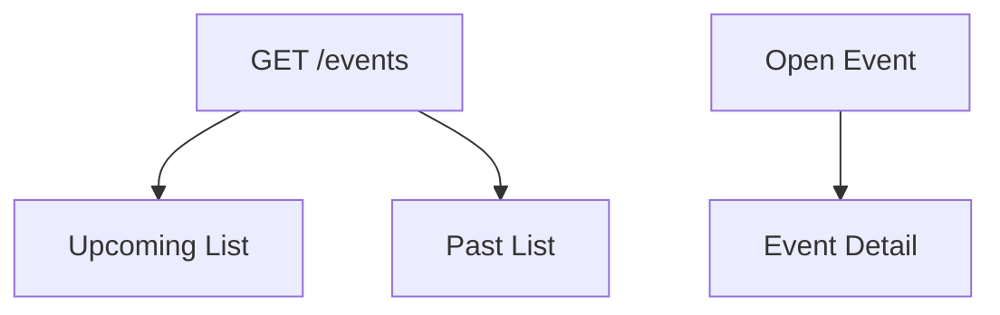

---

## 4. Public Browse Flow (Technical)

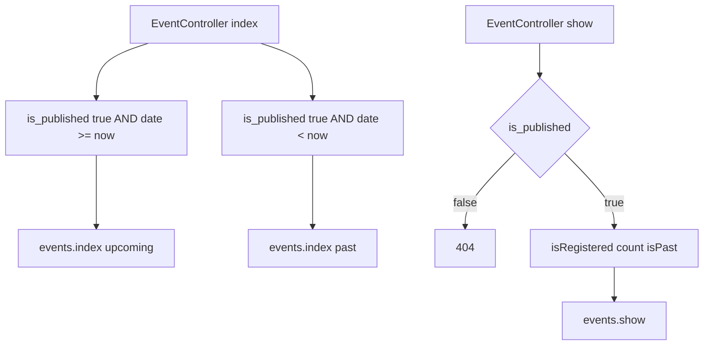

---

## 5. Registration Flow (Presentation)

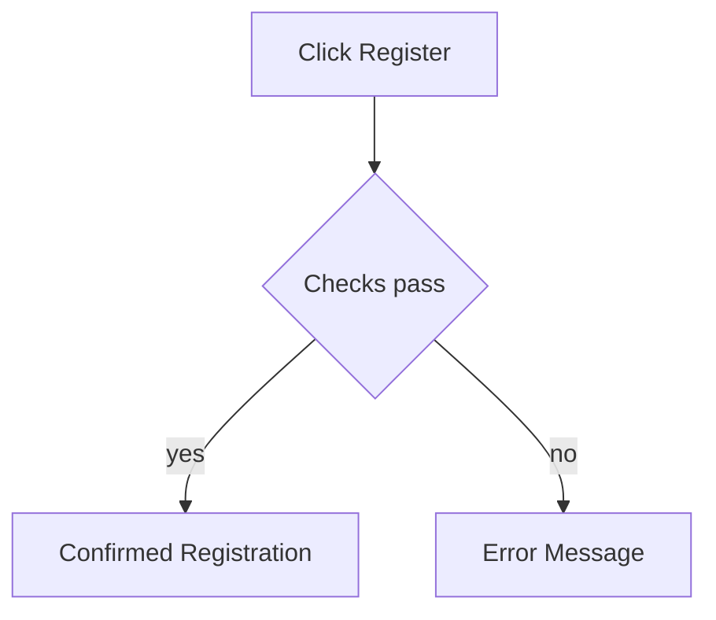

---

## 6. Registration Flow (Technical)

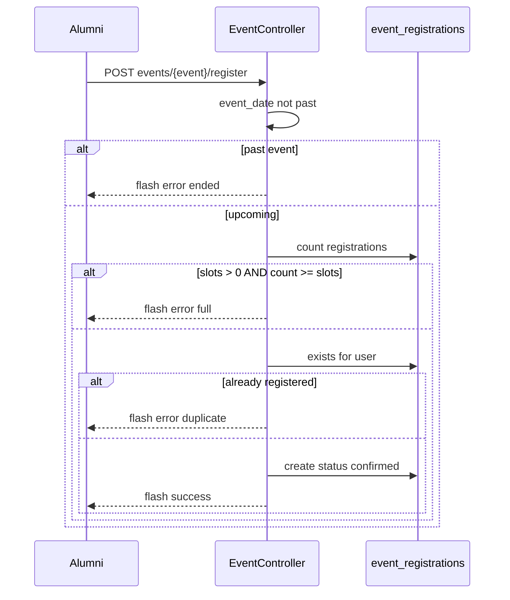

---

## 7. Unregister Flow (Technical)

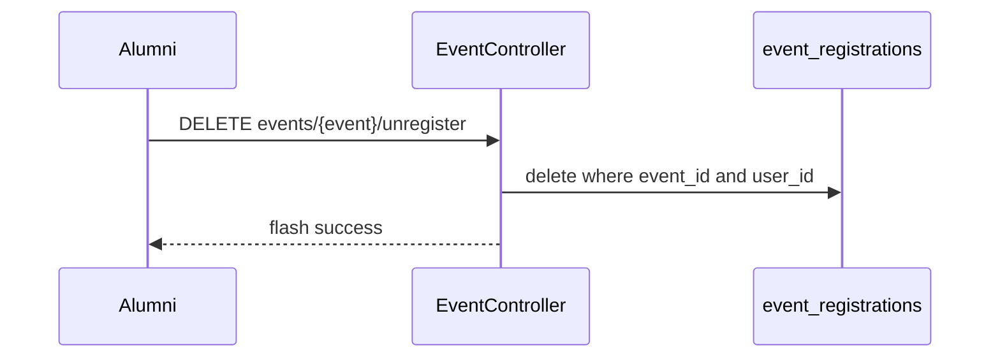

---

## 8. Slots Logic (Presentation)

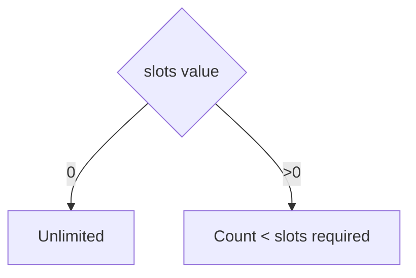

---

## 9. Admin Event Management (Presentation)

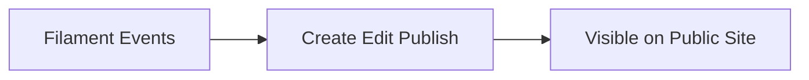

---

## 10. Admin Event Management (Technical)

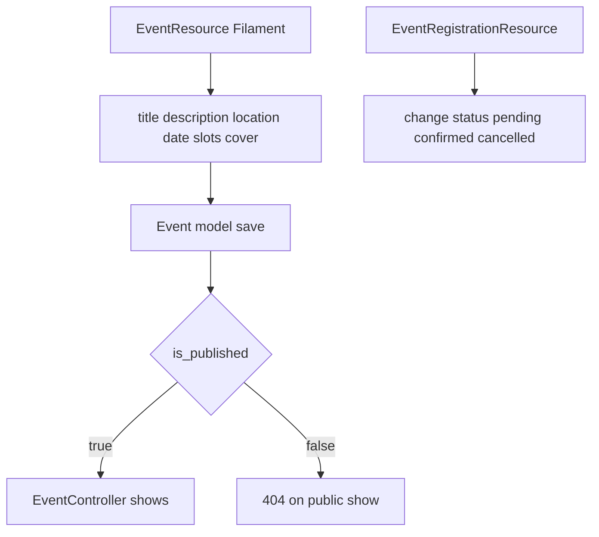

**Public registration** always writes `confirmed` regardless of DB default `pending`.

---

## 11. Gallery Permission Coupling (Presentation)

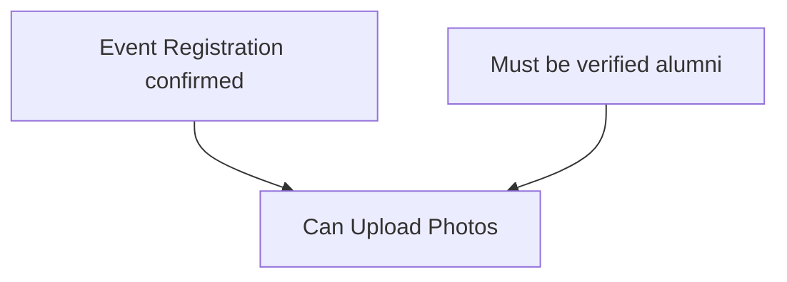

---

## 12. Gallery Permission Coupling (Technical)

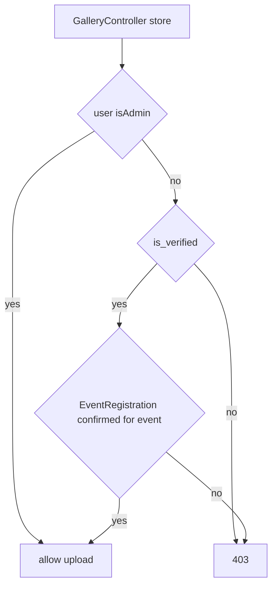

---

## Data Entities

| Table | Role |
|-------|------|
| `events` | Event definition |
| `event_registrations` | User attendance link |

**Unique:** `(event_id, user_id)` prevents duplicate RSVPs.

See [DATABASE_ERD.md](./DATABASE_ERD.md).
