# Filament Admin Architecture

Panel provider: `app/Providers/Filament/AdminPanelProvider.php`. Path: `/admin`. Panel ID: `admin`.

---

## 1. Admin Structure (Presentation)

```mermaid
flowchart TB
    Login[/admin Login] --> Dash[Dashboard]
    Dash --> G1[Users and Profiles]
    Dash --> G2[Content]
    Dash --> G3[Community]
    Dash --> G4[Moderation]
```

---

## 2. Admin Structure (Technical)

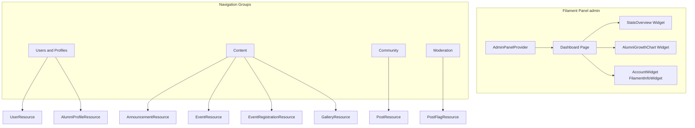

---

## 3. Component Diagram (Presentation)

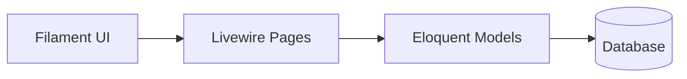

---

## 4. Component Diagram (Technical)

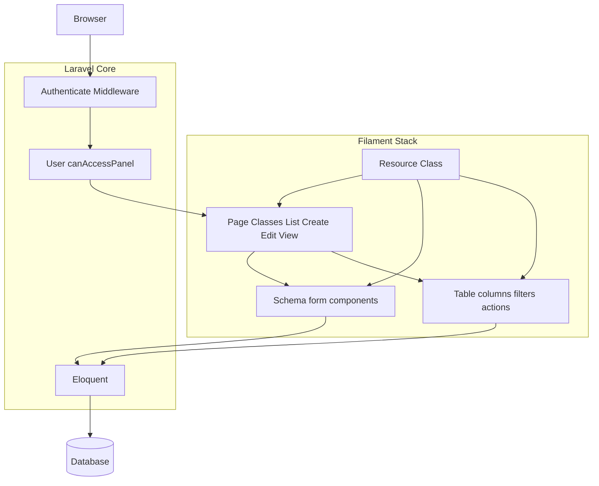

---

## 5. Moderation Workflow (Presentation)

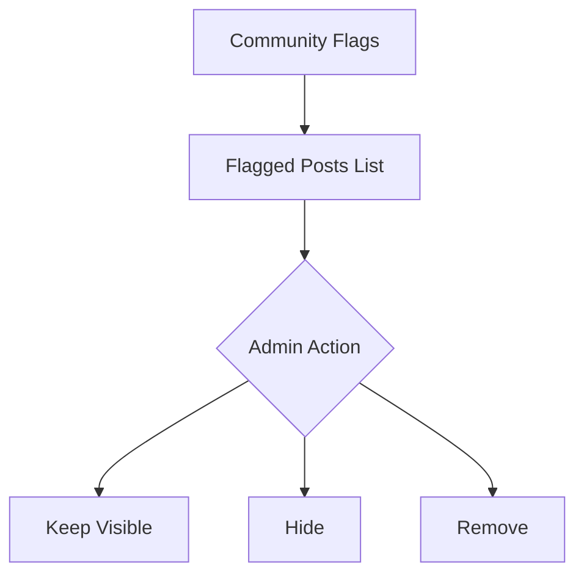

---

## 6. Moderation Workflow (Technical)

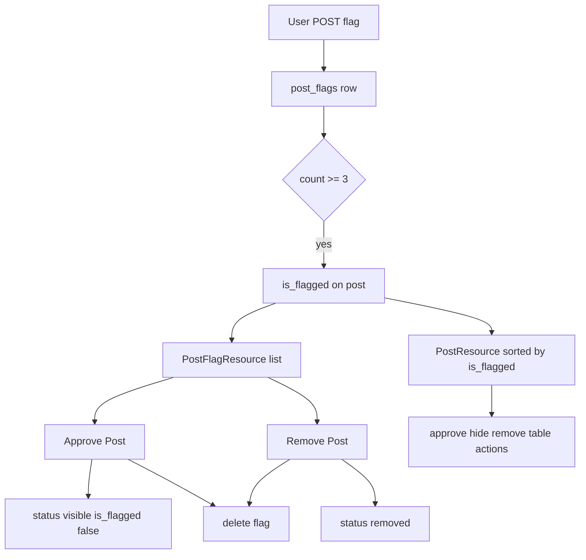

---

## 7. Content Management Flow (Presentation)

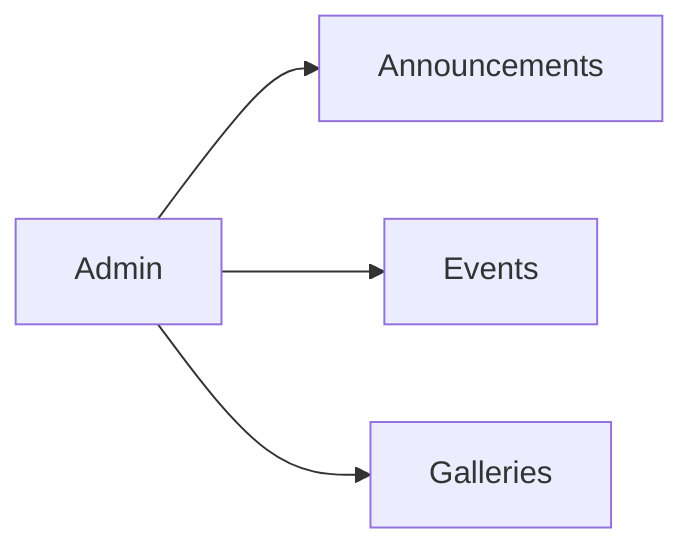

---

## 8. Content Management Flow (Technical)

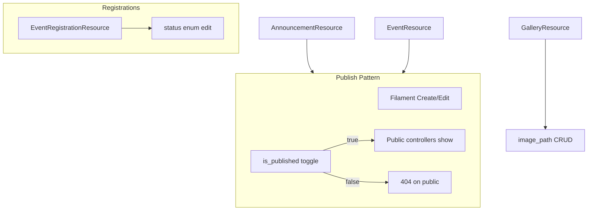

---

## 9. Verification Management (Presentation)

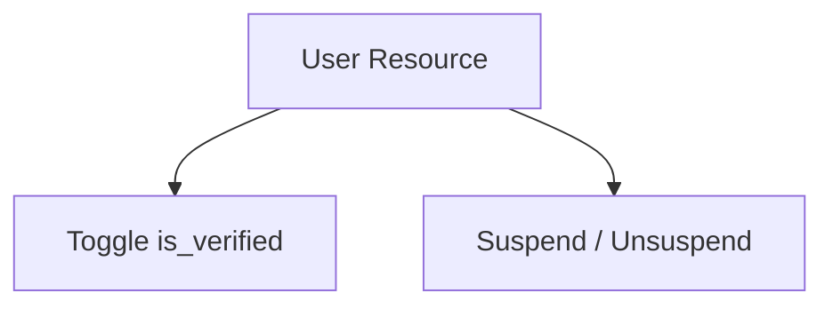

---

## 10. Verification Management (Technical)

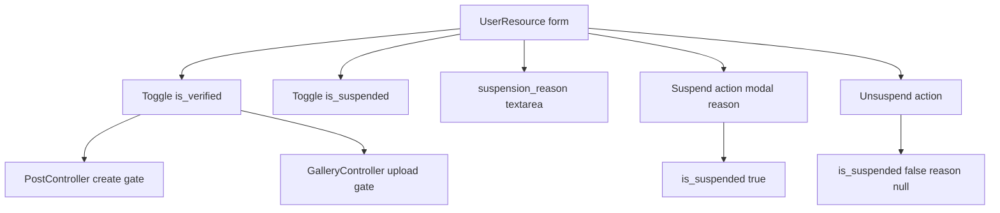

Visible only for alumni: suspend action when `role === alumni` and not suspended.

---

## 11. Resource–Model Map (Reference)

| Resource | Model | Pages |
|----------|-------|-------|
| UserResource | User | List, Create, Edit |
| AlumniProfileResource | AlumniProfile | List, Create, Edit |
| AnnouncementResource | Announcement | List, Create, Edit |
| EventResource | Event | List, Create, Edit |
| EventRegistrationResource | EventRegistration | List, Edit |
| GalleryResource | Gallery | List, Create, Edit |
| PostResource | Post | List, View, Edit |
| PostFlagResource | PostFlag | List |

---

## 12. Dashboard Data Flow (Presentation)

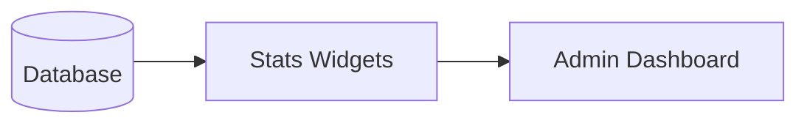

---

## 13. Dashboard Data Flow (Technical)

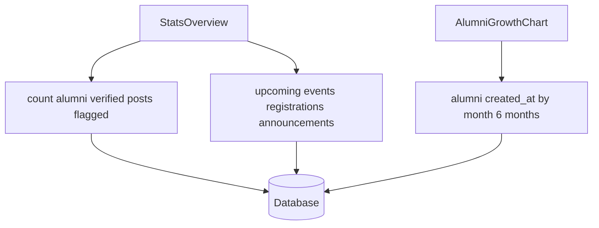

---

## Middleware (Filament)

EncryptCookies → StartSession → CSRF → SubstituteBindings → Filament events → **Authenticate**

Configured in `AdminPanelProvider::panel()->middleware()` and `authMiddleware()`.
