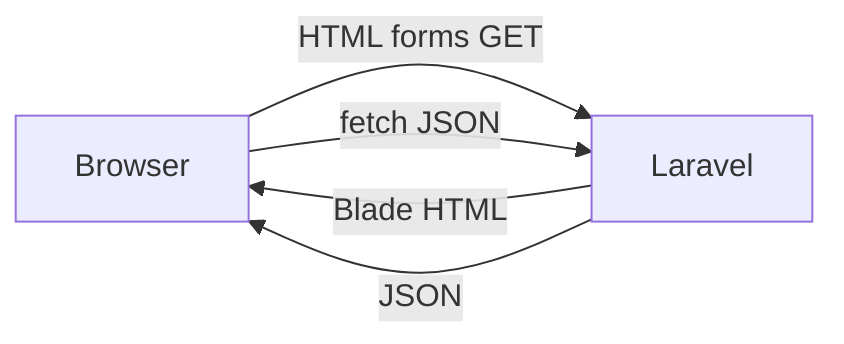
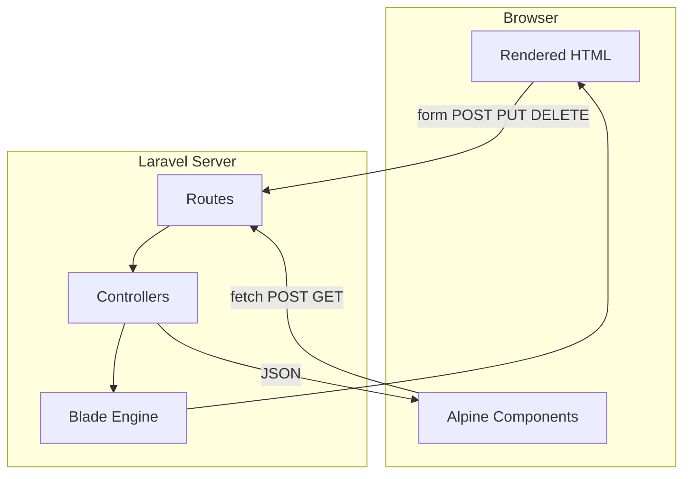
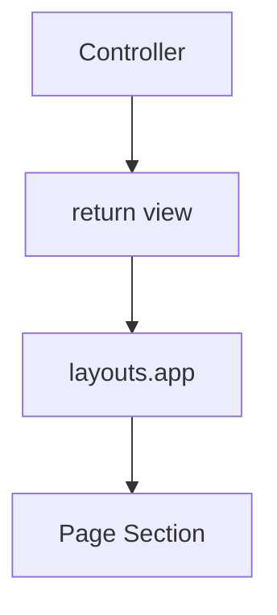
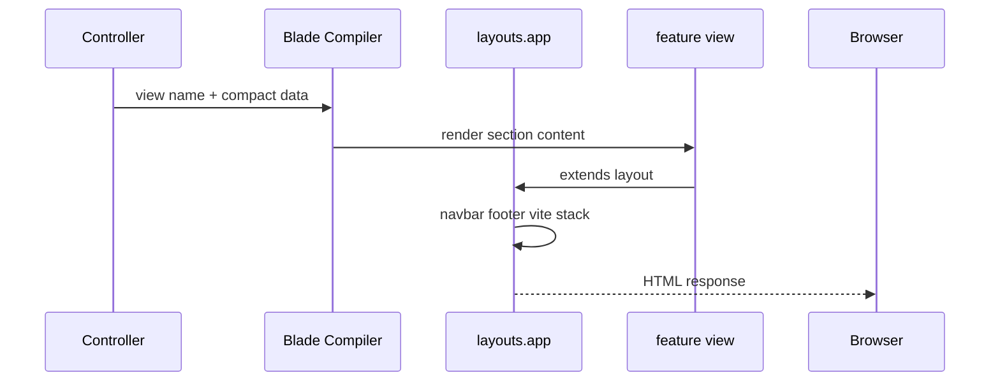
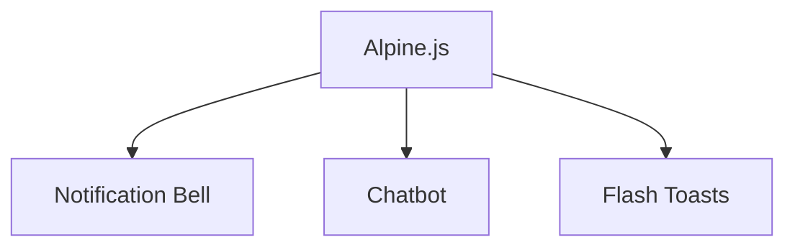
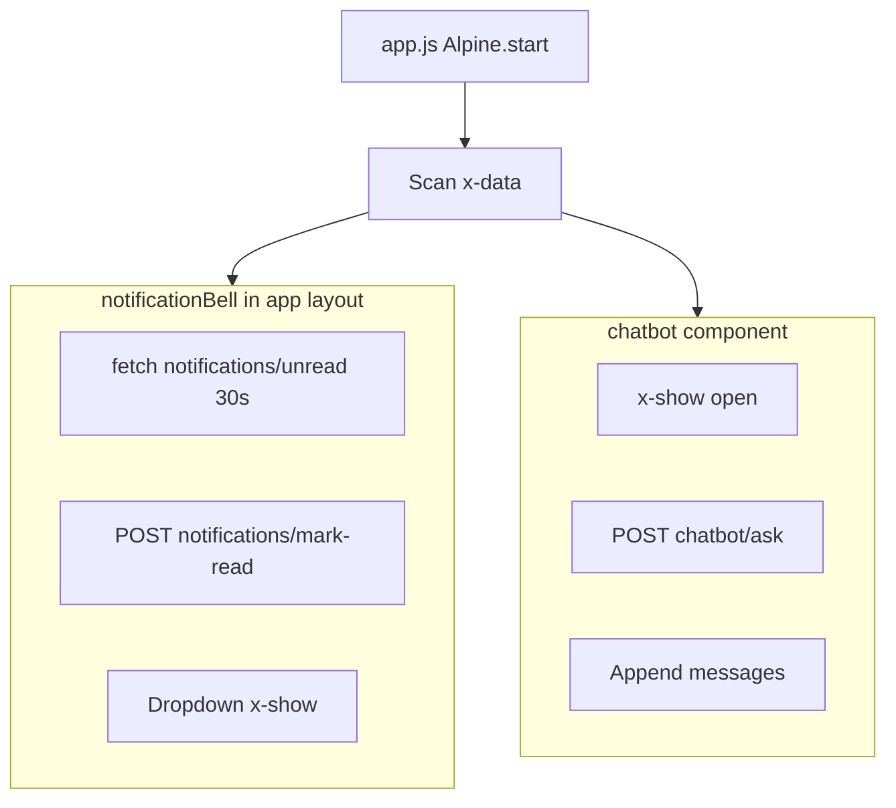
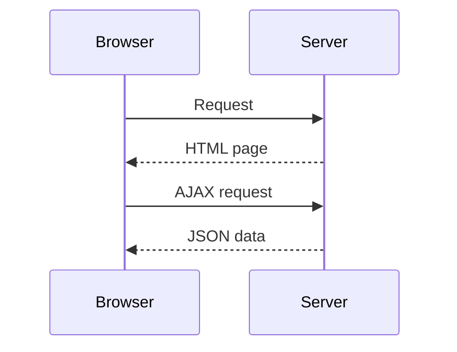
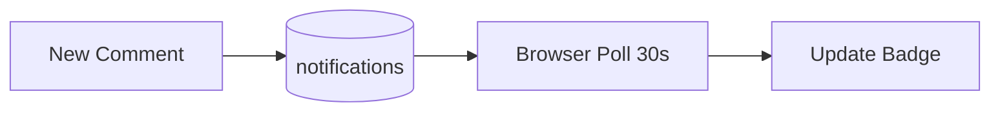
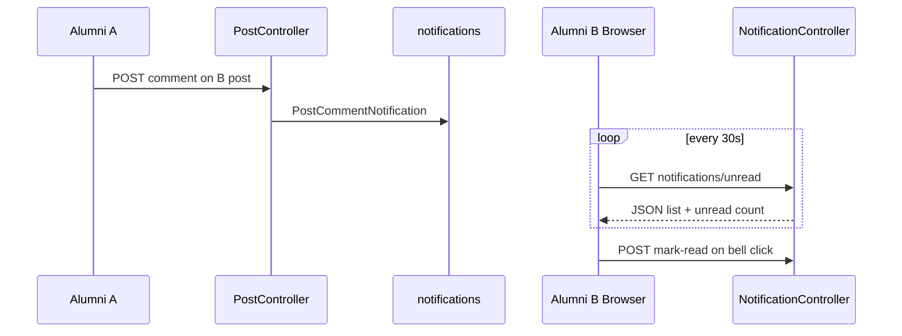
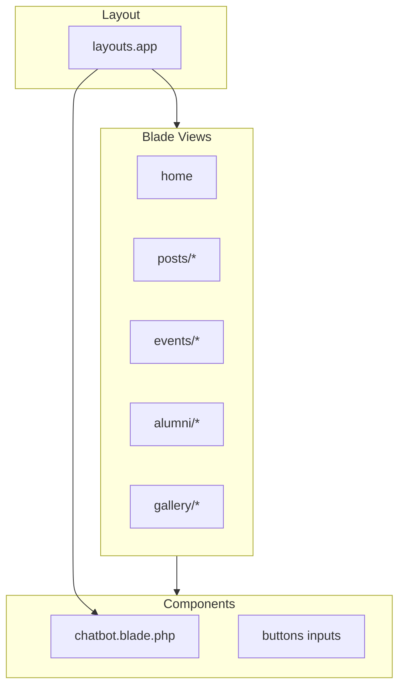

# Frontend / Backend Interaction

Public UI: Blade + Tailwind + Alpine.js + Vite. Admin UI: Filament (separate asset pipeline).

---

## 1. Overall Interaction (Presentation)



---

## 2. Overall Interaction (Technical)



---

## 3. Blade Rendering Flow (Presentation)



---

## 4. Blade Rendering Flow (Technical)



**Primary layout:** `resources/views/layouts/app.blade.php`  
**Exception:** `dashboard.blade.php` uses `<x-app-layout>` (Breeze).

---

## 5. Vite Asset Flow (Presentation)

```mermaid
flowchart LR
    Dev[npm run dev] --> Vite[Vite]
    Vite --> Build[public/build]
    Build --> Blade[@vite directive]
```

---

## 6. Vite Asset Flow (Technical)

```mermaid
flowchart TB
    subgraph sources [Source Files]
        CSS[resources/css/app.css]
        JS[resources/js/app.js]
        BS[resources/js/bootstrap.js]
    end

    subgraph vite [Vite laravel-vite-plugin]
        CFG[vite.config.js]
        DEV[dev HMR]
        PROD[npm run build]
    end

    subgraph output [Output]
        MAN[public/build/manifest.json]
        ASSETS[compiled css js]
    end

    CSS --> CFG
    JS --> BS --> CFG
    CFG --> DEV
    CFG --> PROD --> MAN --> ASSETS
    Blade[@vite in layout] --> ASSETS
```

---

## 7. Alpine.js Interactions (Presentation)



---

## 8. Alpine.js Interactions (Technical)



---

## 9. Request-Response Lifecycle (Presentation)



---

## 10. Request-Response Lifecycle (Technical)

| Interaction | Method | Response | Example |
|-------------|--------|----------|---------|
| Page load | GET | HTML 200 | `/posts` |
| Form submit | POST | Redirect + flash | create post |
| Reaction | POST | JSON 200 | `/posts/{id}/react` |
| Notifications | GET | JSON 200 | `/notifications/unread` |
| Mark read | POST | JSON 200 | `/notifications/mark-read` |
| Chatbot | POST | JSON 200 | `/chatbot/ask` |

---

## 11. Notification Updates (Presentation)



---

## 12. Notification Updates (Technical)



---

## 13. Frontend / Backend Communication (CSRF)

```mermaid
flowchart TB
    Layout[layout meta csrf-token] --> Forms[@csrf on POST forms]
    Layout --> Fetch[Alpine fetch X-CSRF-TOKEN header]
    Fetch --> Laravel[VerifyCsrfToken middleware]
    Forms --> Laravel
```

**Axios:** `bootstrap.js` sets `X-Requested-With` and CSRF for same-origin requests.

---

## 14. Component Diagram (Public Frontend)



---

## Key Non-SPA Behaviors

- Full page navigation for most actions
- Partial updates only for reactions, notifications, chatbot
- No Vue/React root application

See [SYSTEM_SEQUENCE_DIAGRAMS.md](./SYSTEM_SEQUENCE_DIAGRAMS.md) for end-to-end sequences.
