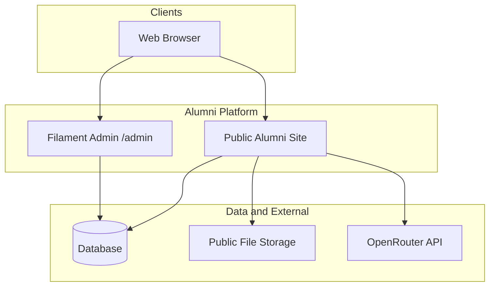
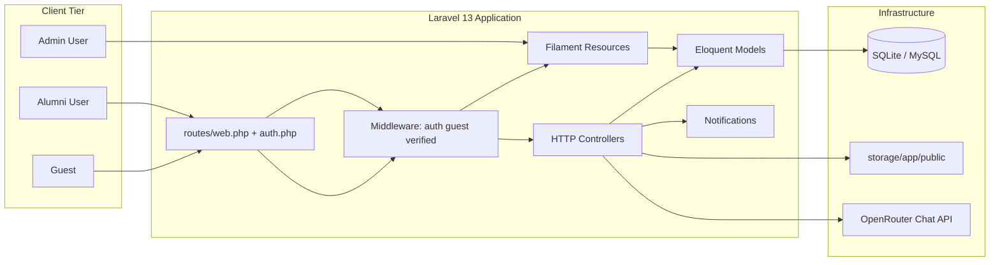
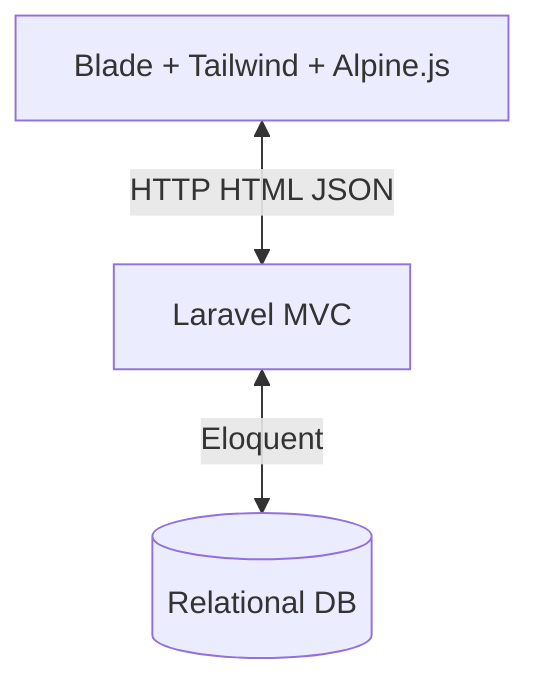
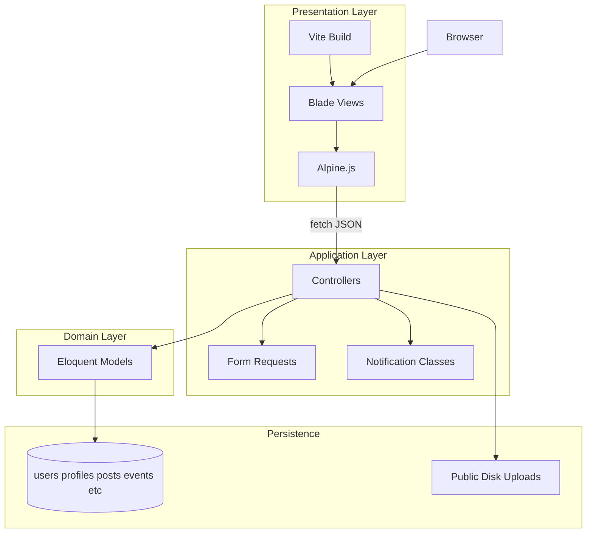
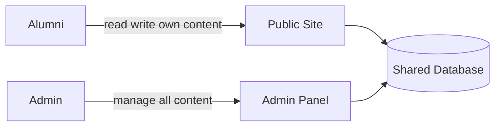
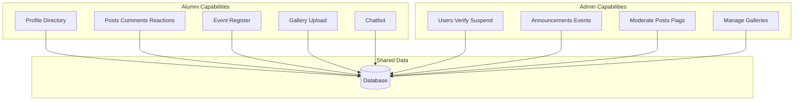
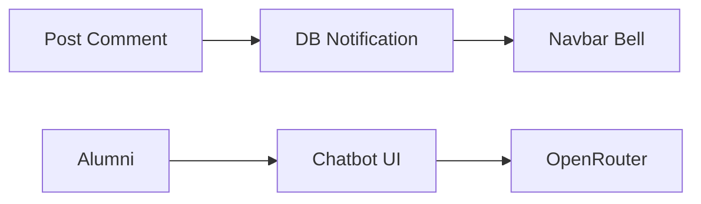
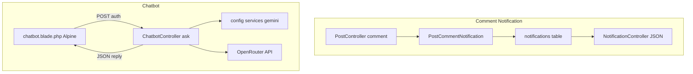
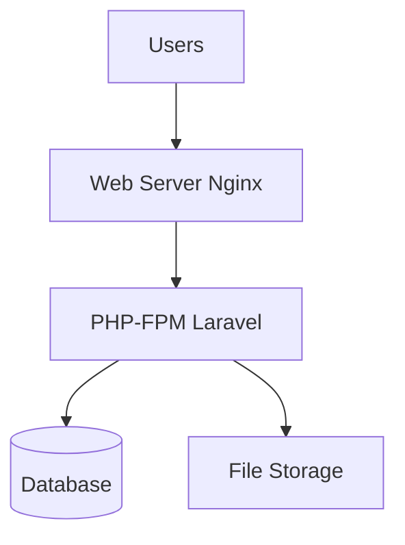
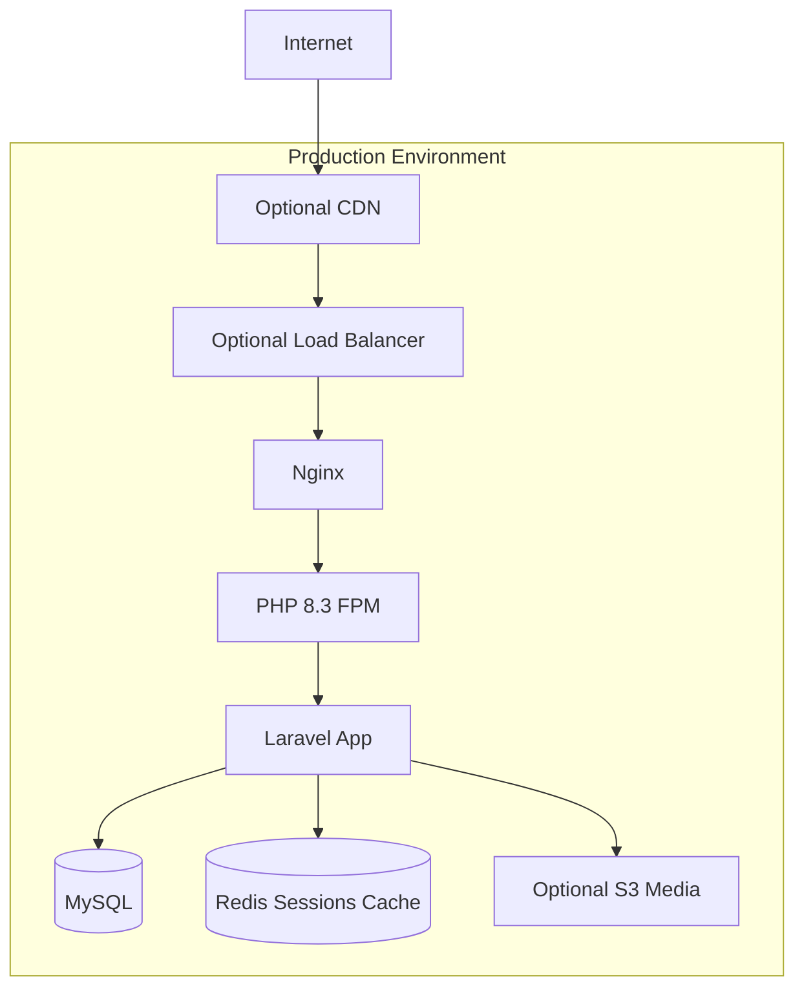

# High-Level System Architecture

Alumni Platform — Ramon Magsaysay Memorial College. Laravel 13 monolith with public Blade site and Filament admin.

---

## 1. Overall Ecosystem (Presentation)

**Summary:** Single Laravel application serves alumni-facing pages and admin panel. Media on disk; chatbot calls external AI from server only.

---

## 2. Overall Ecosystem (Technical)

**Summary:** No separate API app or microservices. Filament shares models and database with public controllers.

---

## 3. Frontend / Backend / Database (Presentation)

---

## 4. Frontend / Backend / Database (Technical)

---

## 5. Admin and Alumni Interaction (Presentation)

---

## 6. Admin and Alumni Interaction (Technical)

**Note:** Alumni cannot access Filament; `User.canAccessPanel` requires `role = admin`.

---

## 7. Notification and Chatbot Integration (Presentation)

---

## 8. Notification and Chatbot Integration (Technical)

---

## 9. Deployment Overview (Presentation)

---

## 10. Deployment Overview (Technical)

**Dev default:** SQLite + local `storage/app/public` per `.env.example`.

---

## Component Inventory (Reference)

| Component | Path / Technology |
|-----------|-------------------|
| Public routes | `routes/web.php` |
| Auth routes | `routes/auth.php` |
| Admin panel | `app/Providers/Filament/AdminPanelProvider.php` |
| Models | `app/Models/*` (10 models) |
| Primary layout | `resources/views/layouts/app.blade.php` |

See [LOW_LEVEL_SYSTEM_ARCHITECTURE.md](./LOW_LEVEL_SYSTEM_ARCHITECTURE.md) for request lifecycle detail.
