# Low-Level System Architecture

Internal structure based on actual codebase. **No `app/Services` layer** — controllers and Filament resources call models directly.

---

## 1. Layer Interaction (Presentation)

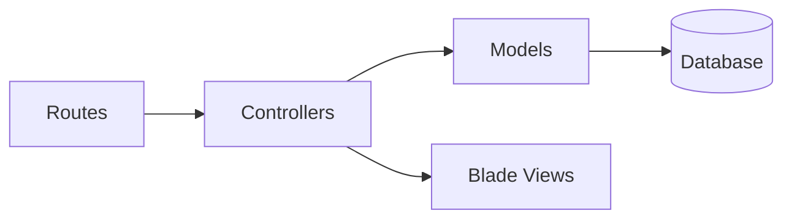

---

## 2. Layer Interaction (Technical)

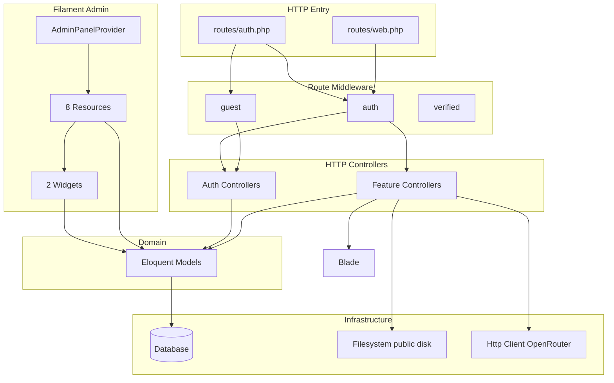

---

## 3. Controller–Model Interaction (Presentation)

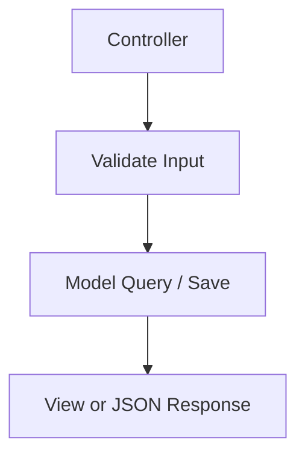

**Note:** No service classes between controller and model.

---

## 4. Controller–Model Interaction (Technical)

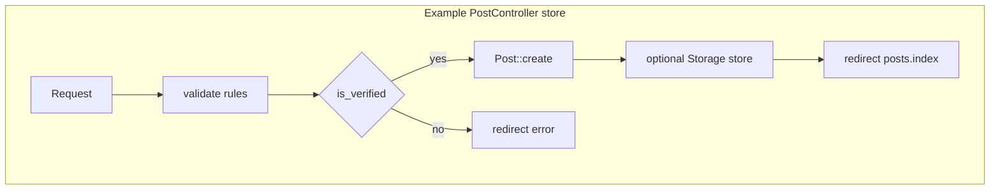

---

## 5. Middleware Flow (Presentation)

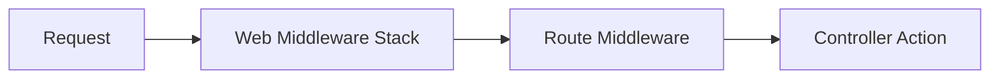

---

## 6. Middleware Flow (Technical)

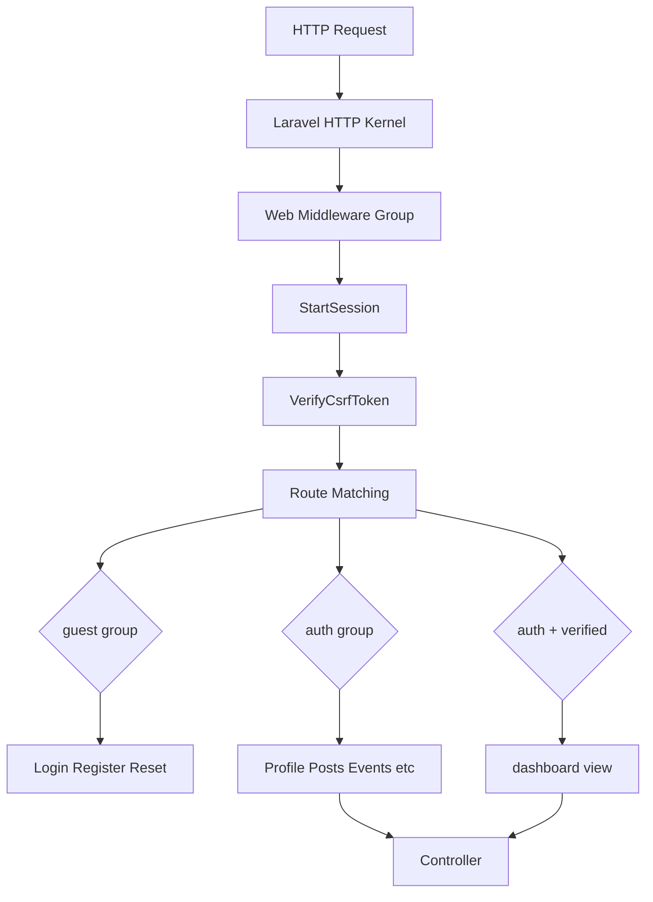

**Custom middleware:** None in `app/Http/Middleware`. Configuration in `bootstrap/app.php` is empty.

---

## 7. Route Handling (Presentation)

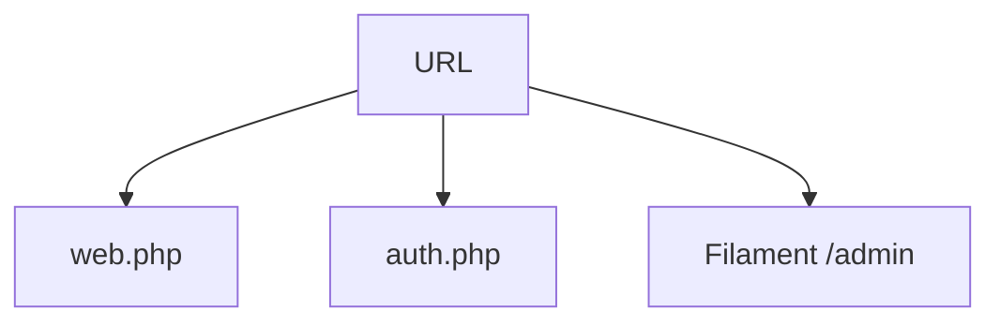

---

## 8. Route Handling (Technical)

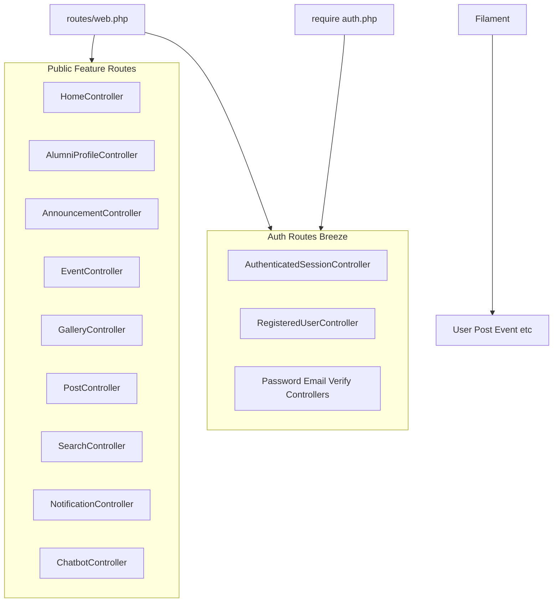

---

## 9. Request Lifecycle (Presentation)

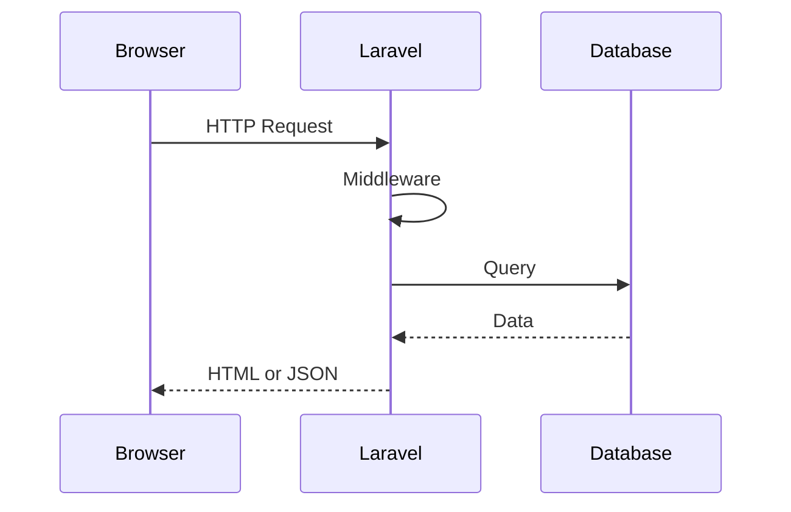

---

## 10. Request Lifecycle (Technical)

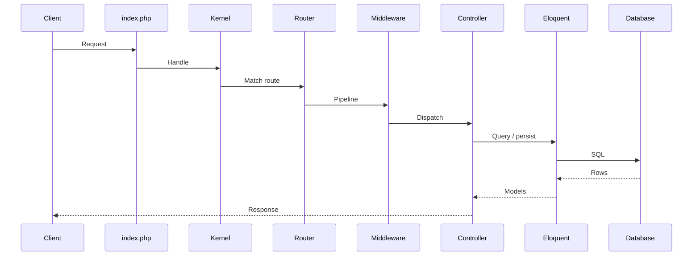

---

## 11. Authentication Processing (Presentation)

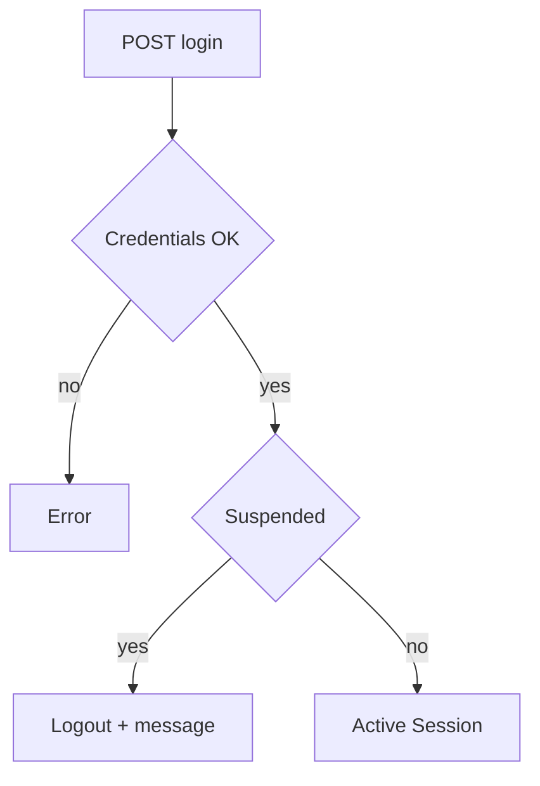

---

## 12. Authentication Processing (Technical)

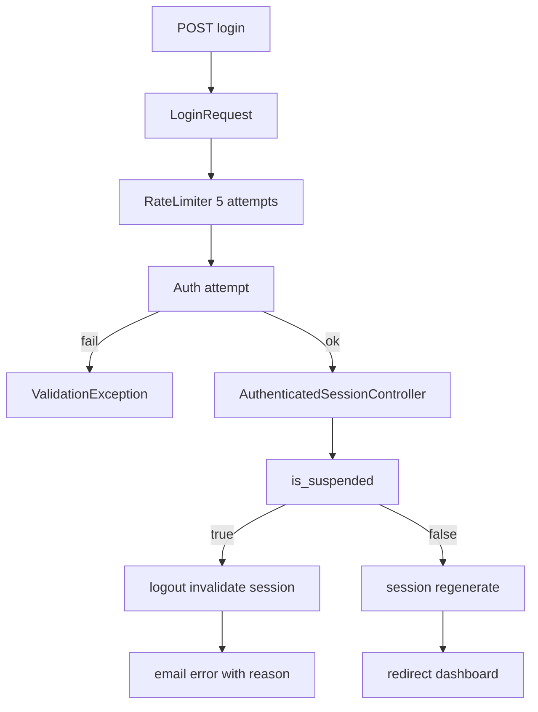

---

## 13. Internal Feature Interactions (Presentation)

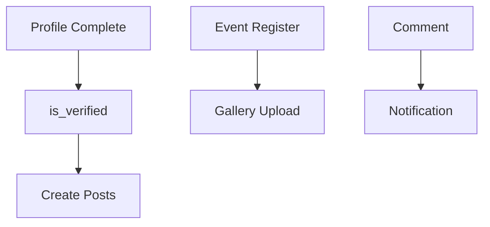

---

## 14. Internal Feature Interactions (Technical)

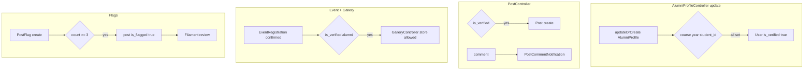

---

## Key Files

| Concern | Location |
|---------|----------|
| Bootstrap | `bootstrap/app.php` |
| Routes | `routes/web.php`, `routes/auth.php` |
| Auth login | `app/Http/Controllers/Auth/AuthenticatedSessionController.php` |
| Filament | `app/Providers/Filament/AdminPanelProvider.php` |

No `app/Policies` — authorization inline in controllers.
