# Posts and Social Interaction Flow

Controller: `PostController`. Models: `Post`, `PostComment`, `PostReaction`, `PostFlag`. Moderation: Filament `PostResource`, `PostFlagResource`.

---

## 1. Social Interaction Overview (Presentation)

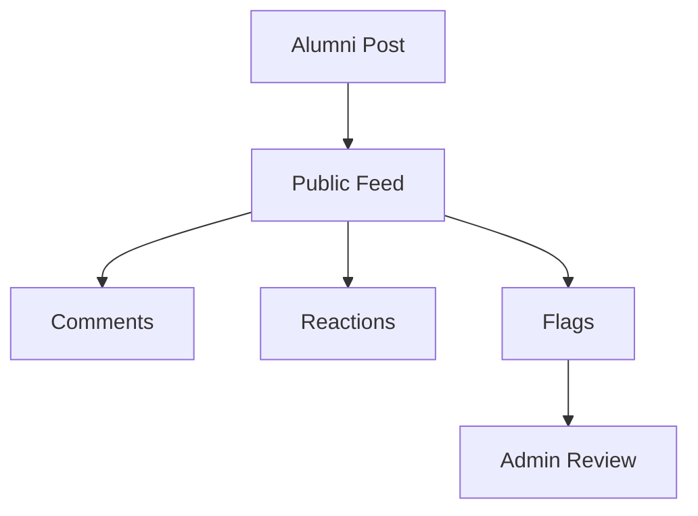

---

## 2. Social Interaction Overview (Technical)

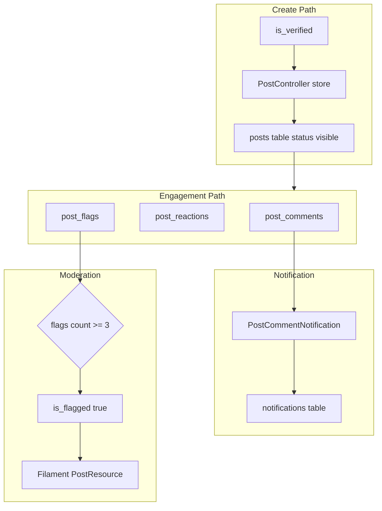

---

## 3. Post Creation Flow (Presentation)

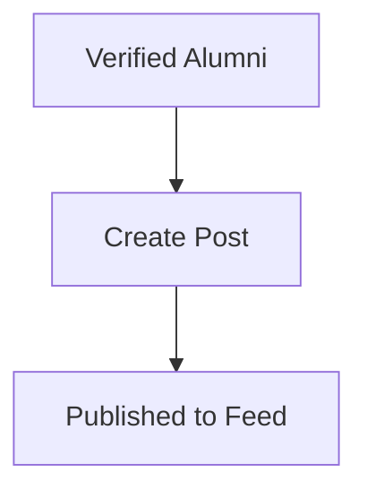

---

## 4. Post Creation Flow (Technical)

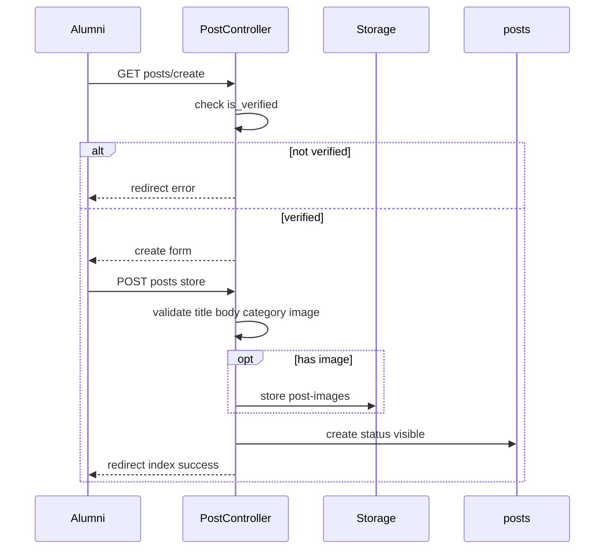

---

## 5. Comment Flow (Presentation)

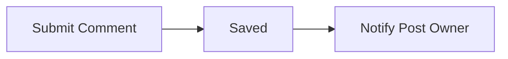

---

## 6. Comment Flow (Technical)

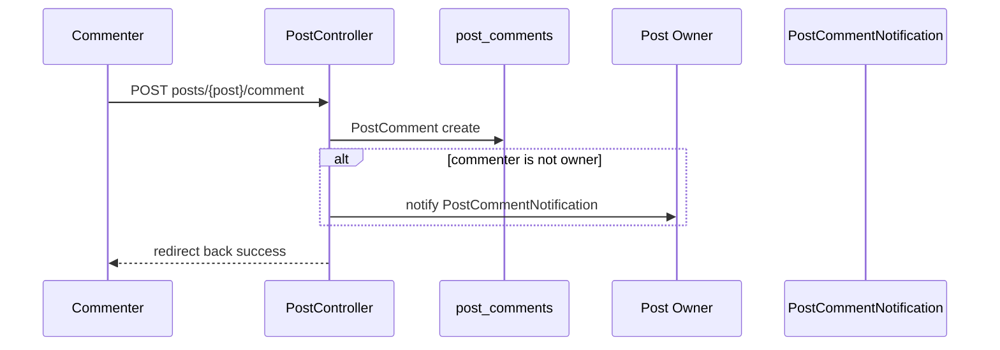

---

## 7. Reaction Flow (Presentation)

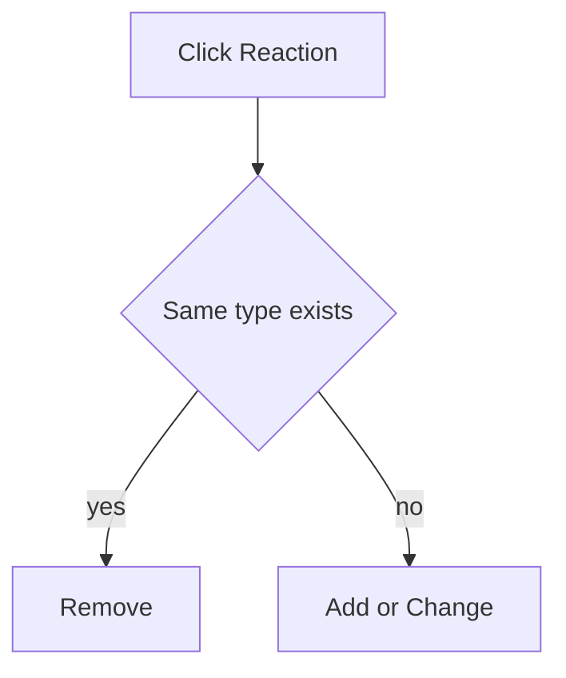

---

## 8. Reaction Flow (Technical)

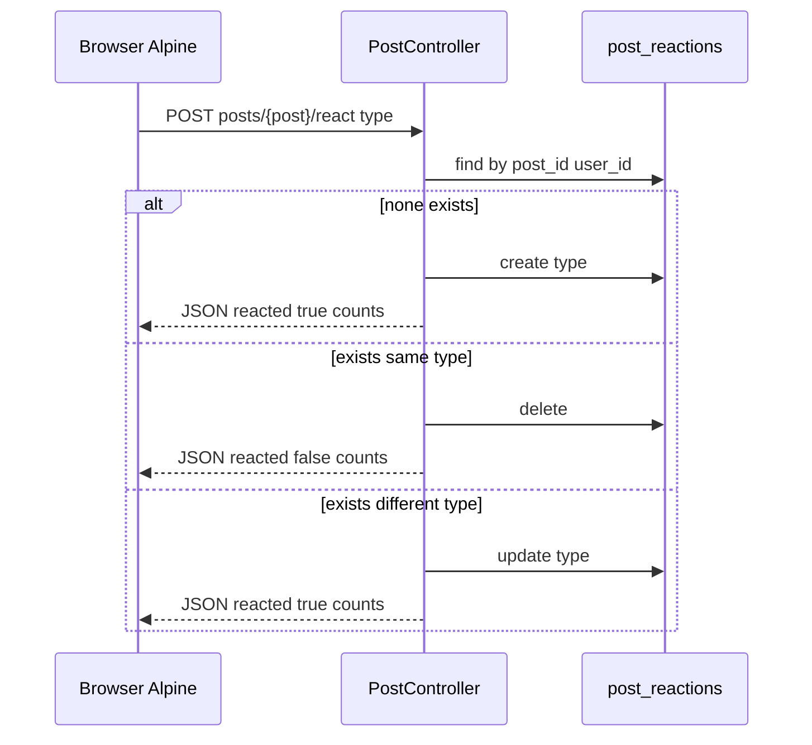

**Unique:** one reaction row per user per post.

---

## 9. Flagging Flow (Presentation)

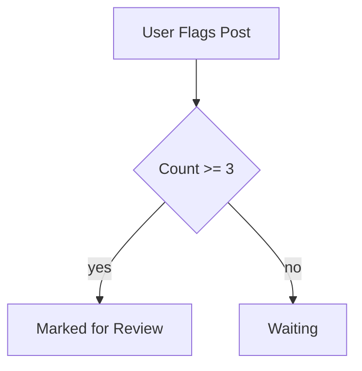

---

## 10. Flagging Flow (Technical)

```mermaid
flowchart TB
    Start[POST posts/{post}/flag] --> O1{own post}
    O1 -->|yes| E1[error]
    O1 -->|no| O2{already flagged by user}
    O2 -->|yes| E2[error]
    O2 -->|no| CR[PostFlag create]
    CR --> CT{flags count >= 3}
    CT -->|yes| FG[post is_flagged true]
    CT -->|no| Done[done]
```

---

## 11. Moderation Flow (Presentation)

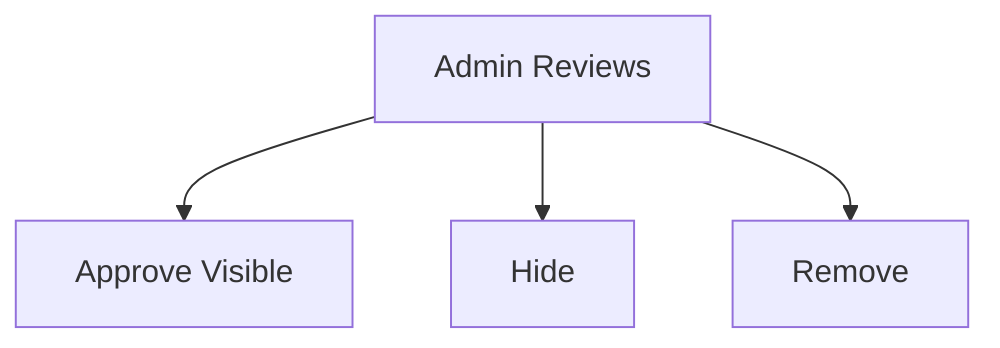

---

## 12. Moderation Flow (Technical)

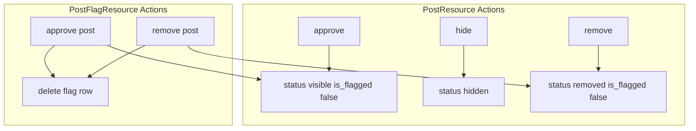

Public feed: only `status = visible` in `PostController@index`.

---

## 13. Post Status State (Presentation)

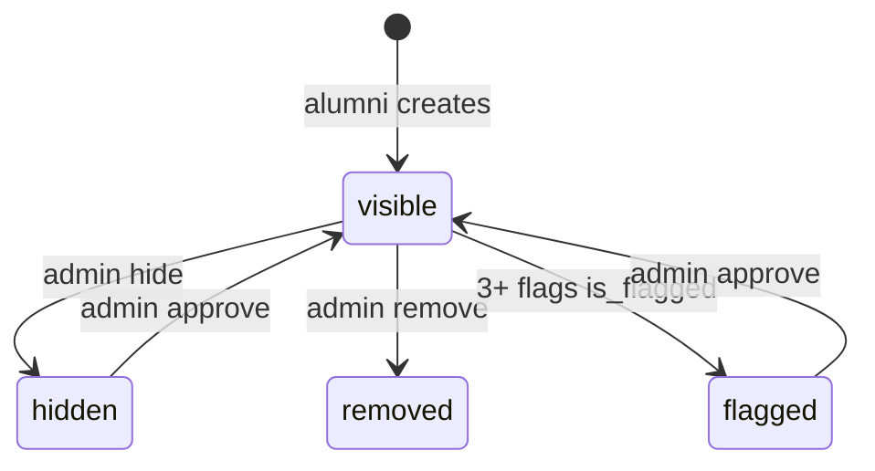

**Note:** `is_flagged` is a boolean marker; visibility controlled by `status`.

---

## Category Enum (Reference)

`career_update` | `achievement` | `opportunity` | `reunion` | `general`

Defined in `Post::CATEGORIES` and migration enum.

See [DATA_FLOW_DIAGRAM.md](./DATA_FLOW_DIAGRAM.md) for DFD view.
