# System Sequence Diagrams

End-to-end sequences for capstone presentation. Based on actual controller and notification code paths.

---

## 1. Homepage Load (Presentation)

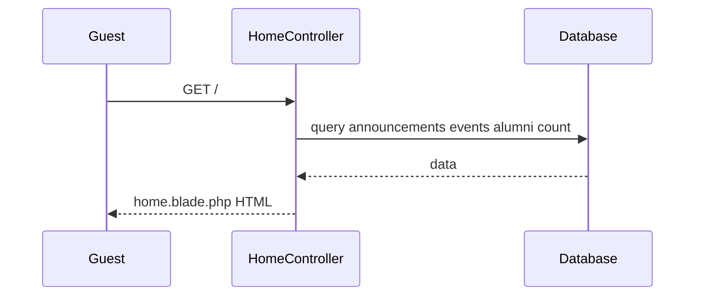

---

## 2. Homepage Load (Technical)

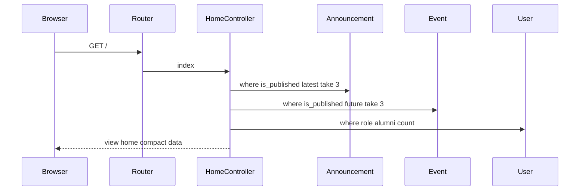

---

## 3. Alumni Registration and First Login (Presentation)

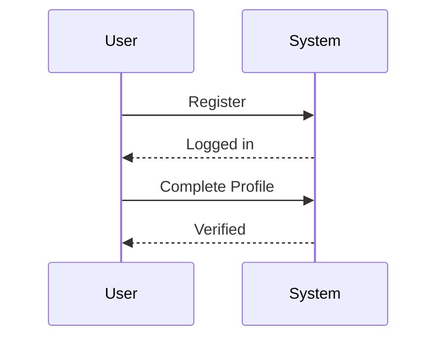

---

## 4. Alumni Registration and First Login (Technical)

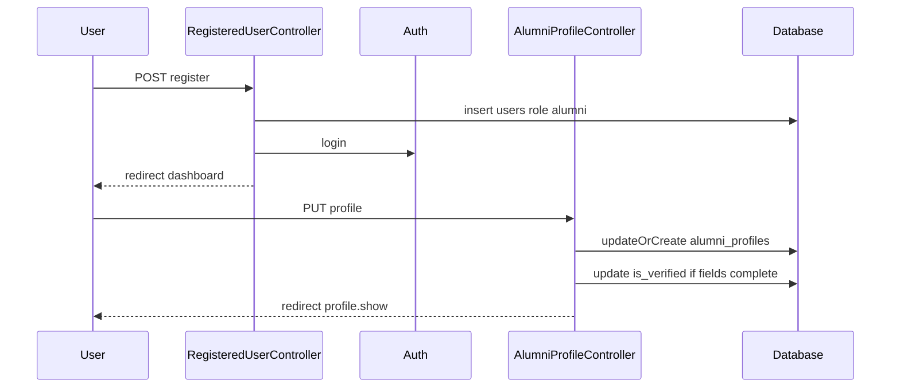

---

## 5. Create Post with Image (Technical)

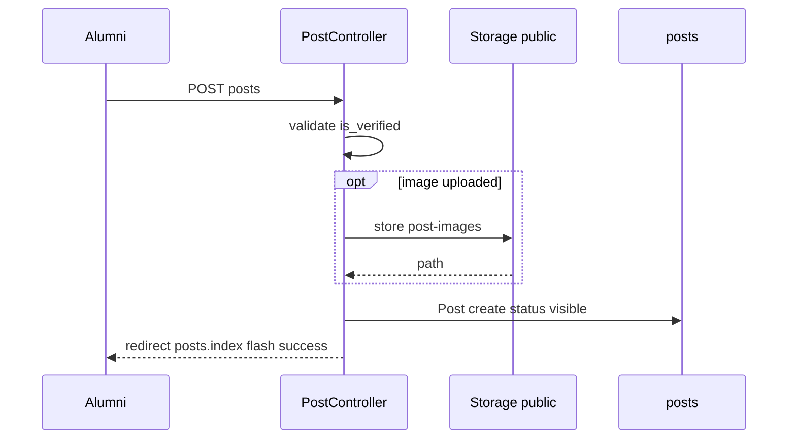

---

## 6. Comment and Notify Owner (Technical)

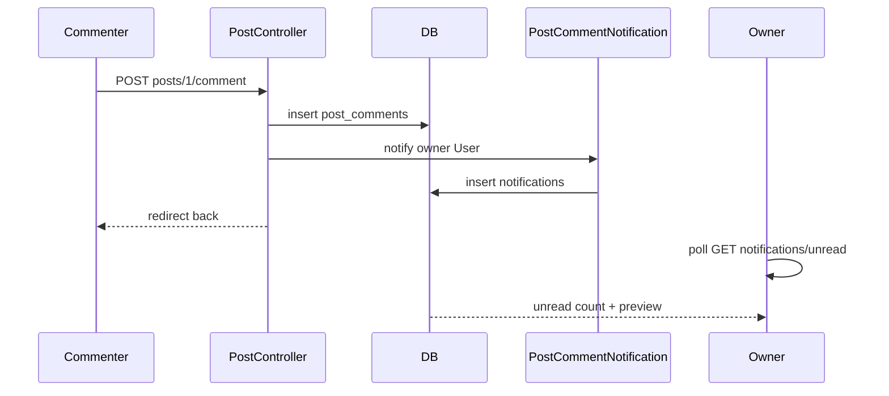

---

## 7. Event Registration (Presentation)

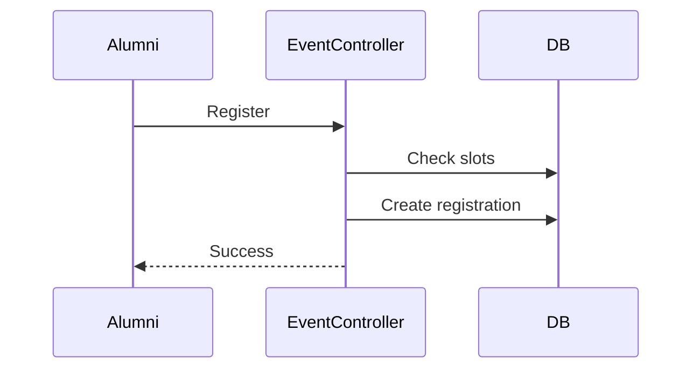

---

## 8. Event Registration (Technical)

Full sequence in [EVENTS_AND_REGISTRATION_FLOW.md](./EVENTS_AND_REGISTRATION_FLOW.md#6-registration-flow-technical).

---

## 9. Gallery Upload After Registration (Technical)

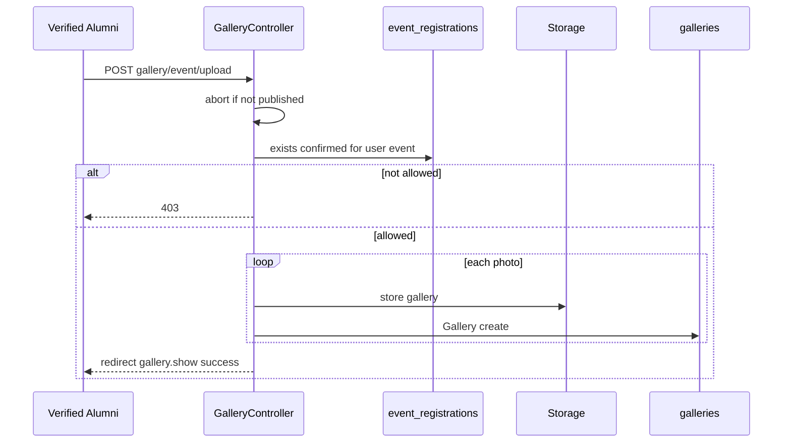

---

## 10. Chatbot Interaction (Presentation)

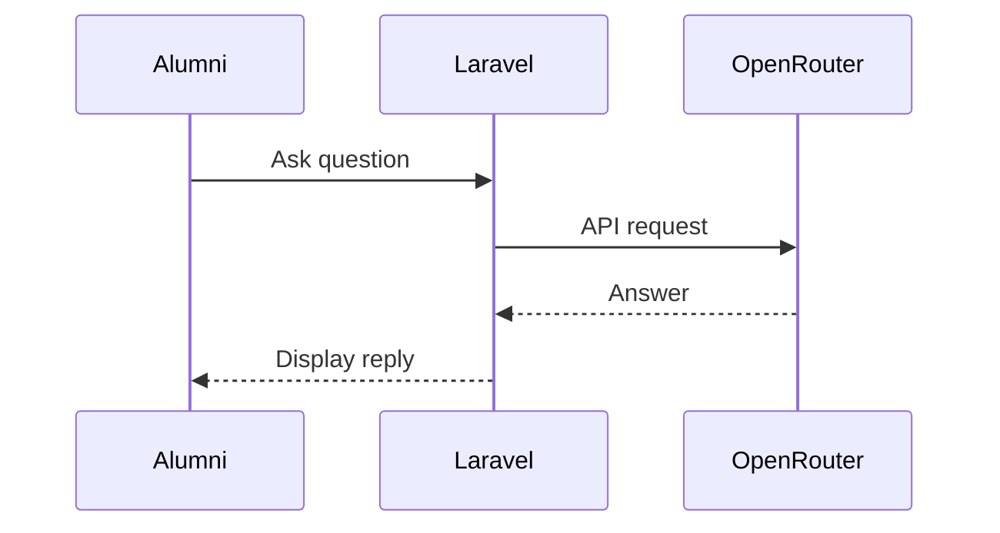

---

## 11. Chatbot Interaction (Technical)

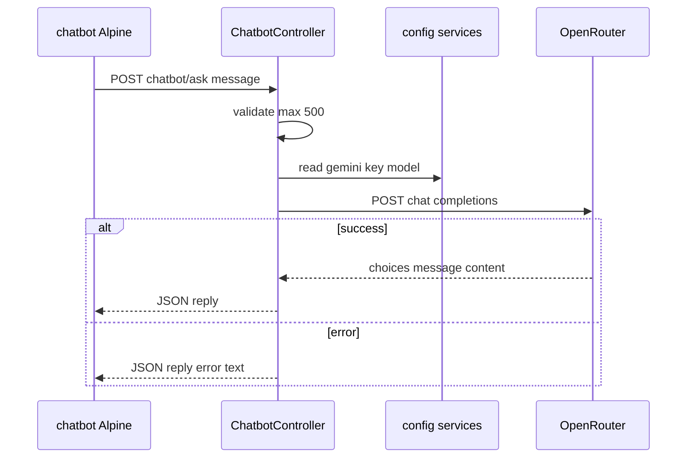

---

## 12. Admin Moderate Flagged Post (Technical)

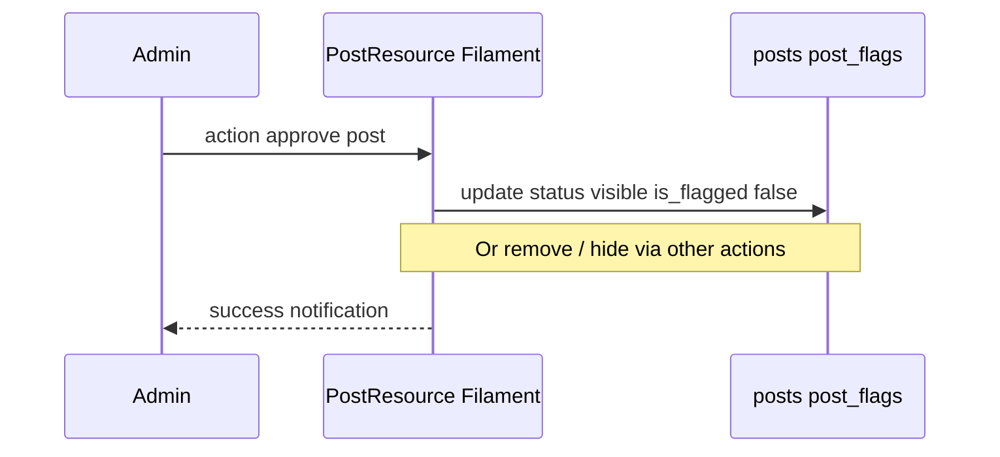

---

## 13. Admin Suspend User (Technical)

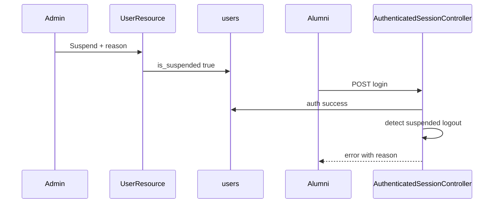

---

## 14. Global Search (Technical)

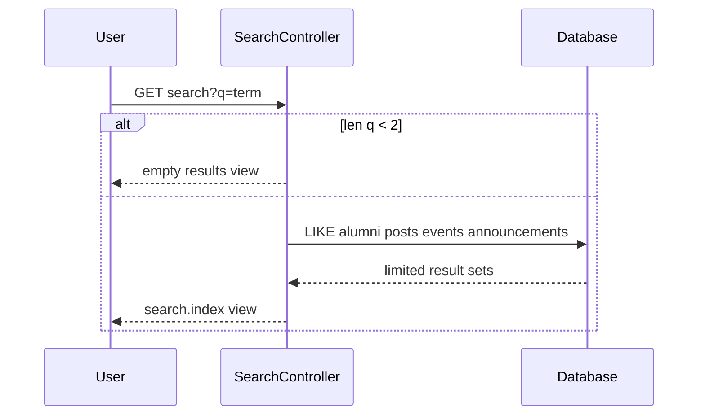

---

## 15. Filament vs Public — Same Post Entity (Presentation)

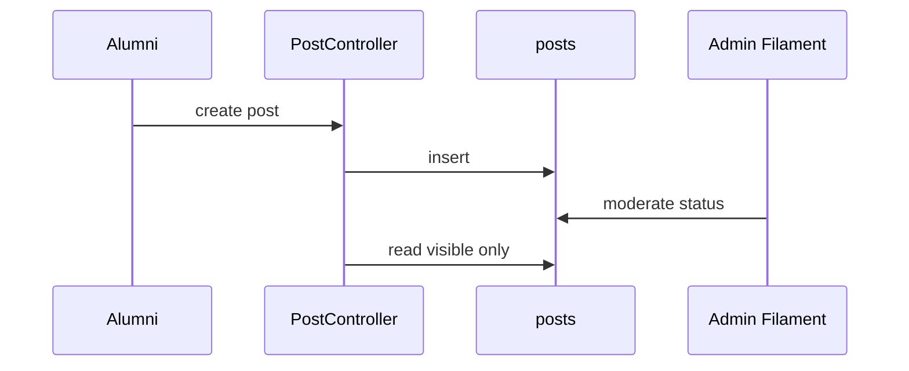

---

## Diagram Index

| Scenario | Primary file |
|----------|----------------|
| Auth login/register | AUTHENTICATION_FLOW.md |
| Roles/permissions | USER_ROLE_AND_PERMISSION_FLOW.md |
| Events | EVENTS_AND_REGISTRATION_FLOW.md |
| Posts/social | POSTS_AND_SOCIAL_INTERACTION_FLOW.md |
| Frontend AJAX | FRONTEND_BACKEND_INTERACTION.md |
| Admin | FILAMENT_ADMIN_ARCHITECTURE.md |

All diagrams use Mermaid syntax renderable in GitHub, GitLab, VS Code, and most markdown preview tools.
