# User Role and Permission Flow

Two roles (`admin`, `alumni`) plus flags (`is_verified`, `is_suspended`). No moderator role; no Policy classes.

---

## 1. Role Model (Presentation)

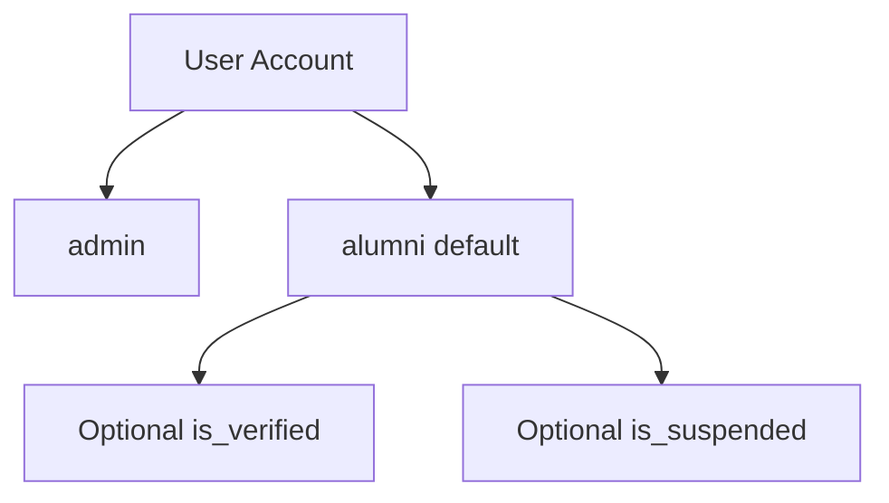

---

## 2. Role Model (Technical)

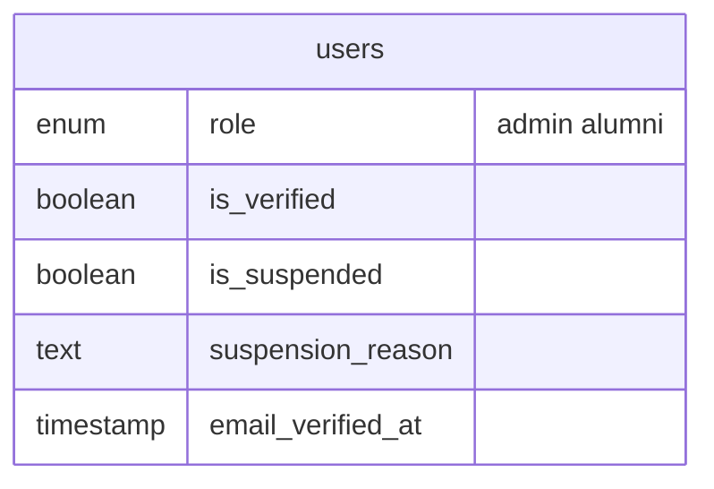

| Field | Applies to | Effect |
|-------|------------|--------|
| `role` | all | admin → Filament; alumni → default |
| `is_verified` | alumni | post create; gallery with registration |
| `is_suspended` | all | login blocked |
| `email_verified_at` | all | dashboard route only |

---

## 3. Permission Matrix (Presentation)

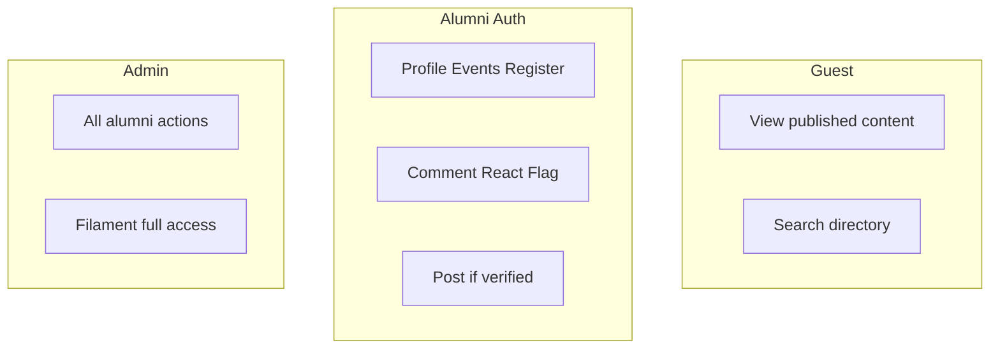

---

## 4. Permission Matrix (Technical)

| Action | guest | alumni | verified | admin |
|--------|:-----:|:------:|:--------:|:-----:|
| View announcements/events/posts | ✓ | ✓ | ✓ | ✓ |
| Alumni directory | ✓ | ✓ | ✓ | ✓ |
| Edit own profile | — | ✓ | ✓ | ✓ |
| Create post | — | — | ✓ | ✓ |
| Comment/react/flag | — | ✓ | ✓ | ✓ |
| Event register | — | ✓ | ✓ | ✓ |
| Gallery upload | — | — | ✓* | ✓ |
| Chatbot | — | ✓ | ✓ | ✓ |
| Filament | — | — | — | ✓ |

\*Verified + confirmed `event_registrations` for that event.

---

## 5. Use Case — Alumni (Presentation)

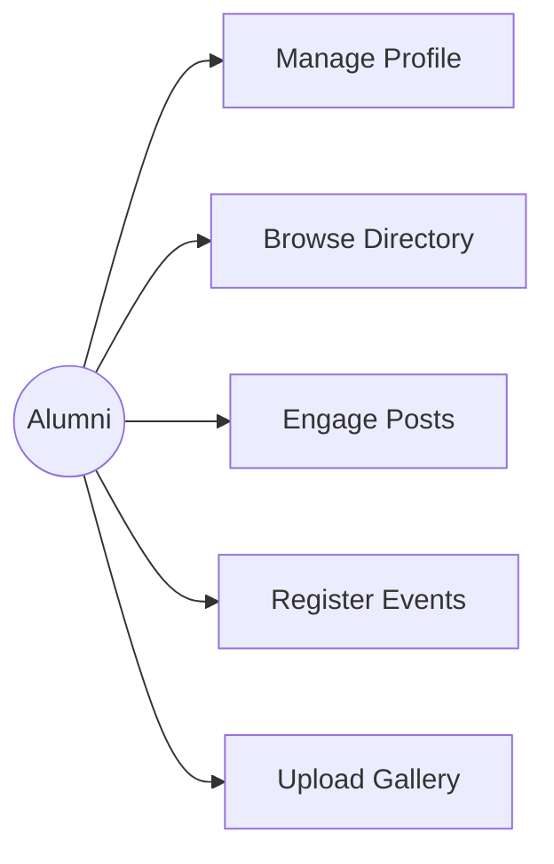

---

## 6. Use Case — Admin (Presentation)

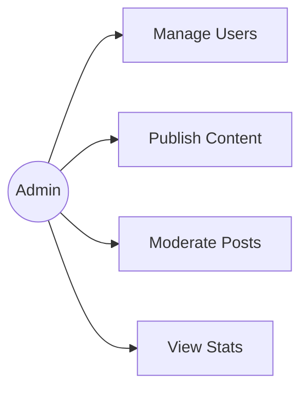

---

## 7. Verification Permission Flow (Presentation)

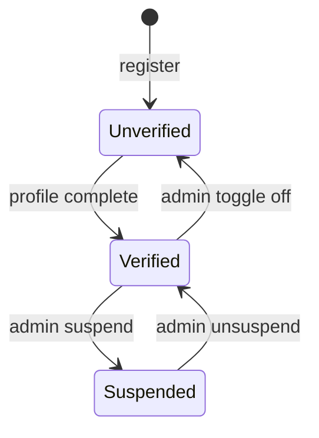

---

## 8. Verification Permission Flow (Technical)

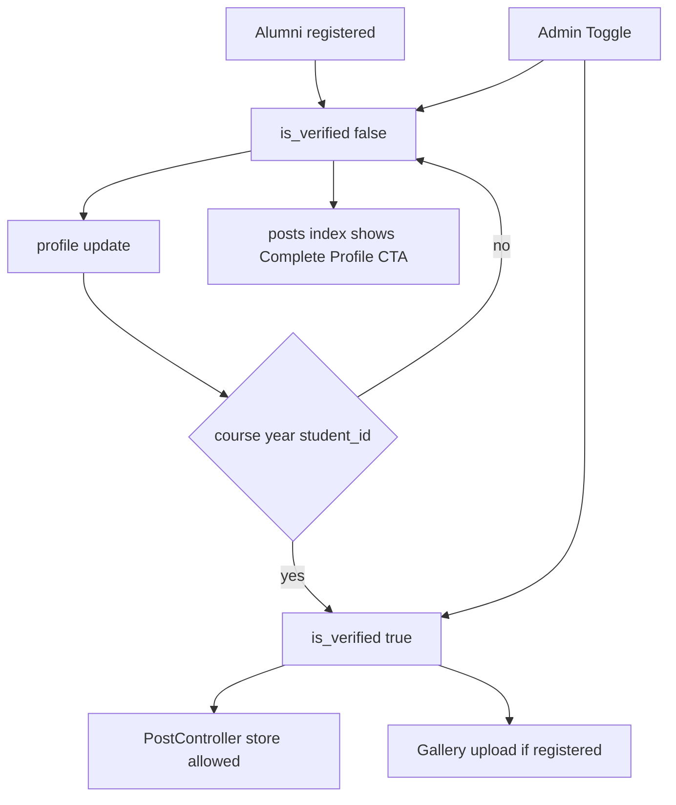

---

## 9. Post Ownership Flow (Technical)

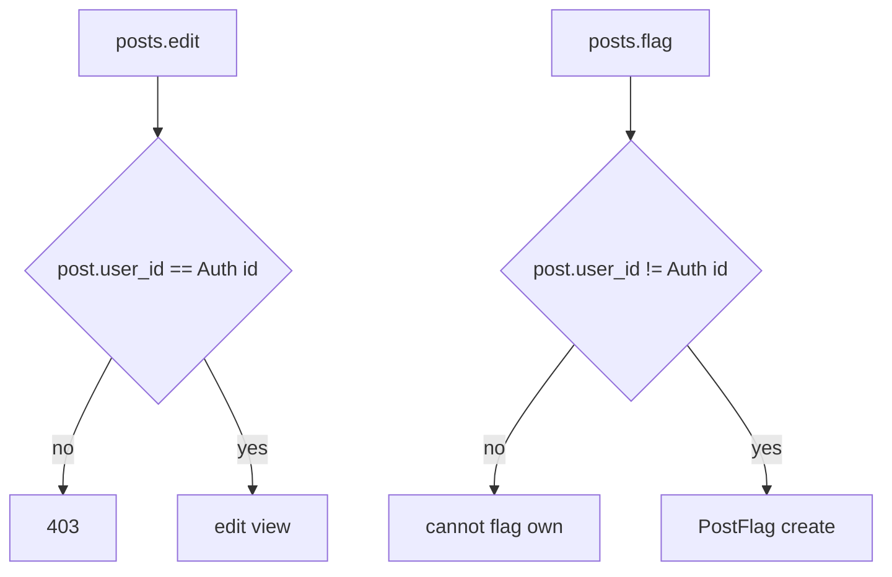

---

## 10. Gallery Permission Flow (Technical)

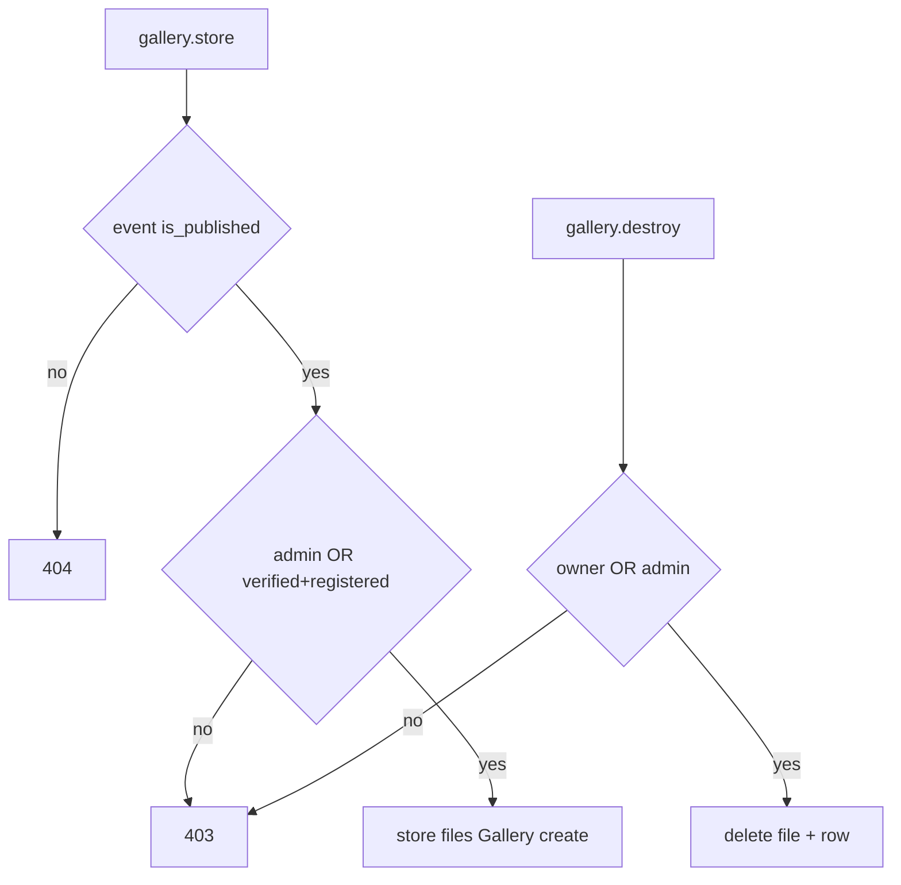

---

## 11. Filament Access Flow (Presentation)

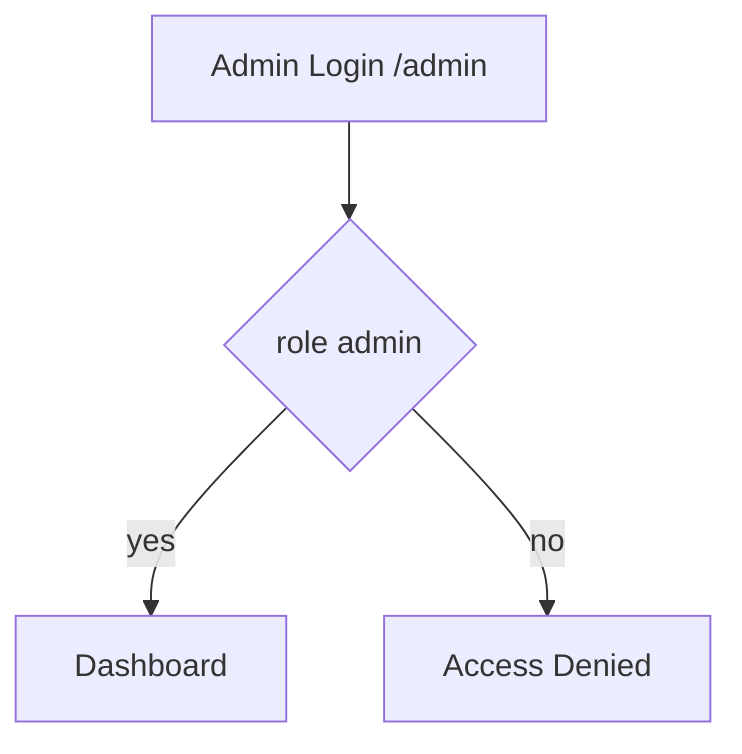

---

## 12. Filament Access Flow (Technical)

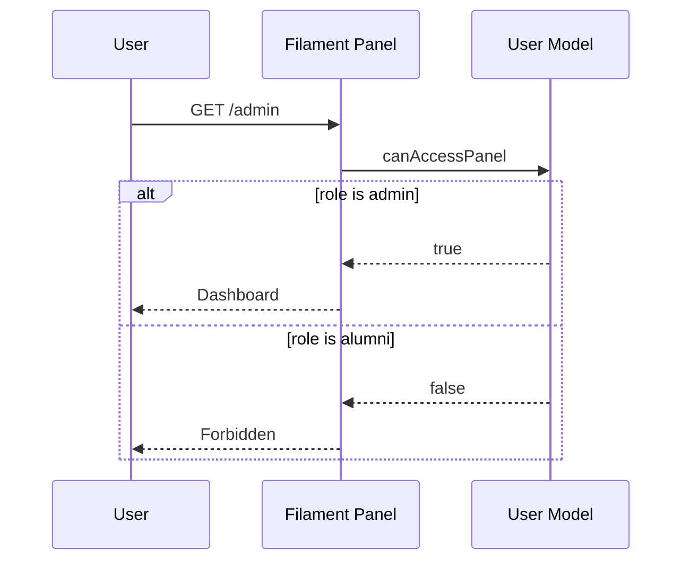

Implementation: `User::canAccessPanel()` returns `$this->role === 'admin'`.

---

## Enforcement Locations

| Rule | Where enforced |
|------|----------------|
| Login required | `Route::middleware('auth')` |
| Verified posts | `PostController` |
| Published content | `abort_if` in controllers |
| Admin panel | `FilamentUser` contract |
| Suspend | `AuthenticatedSessionController` |

Future improvement: Laravel Policies per model.
