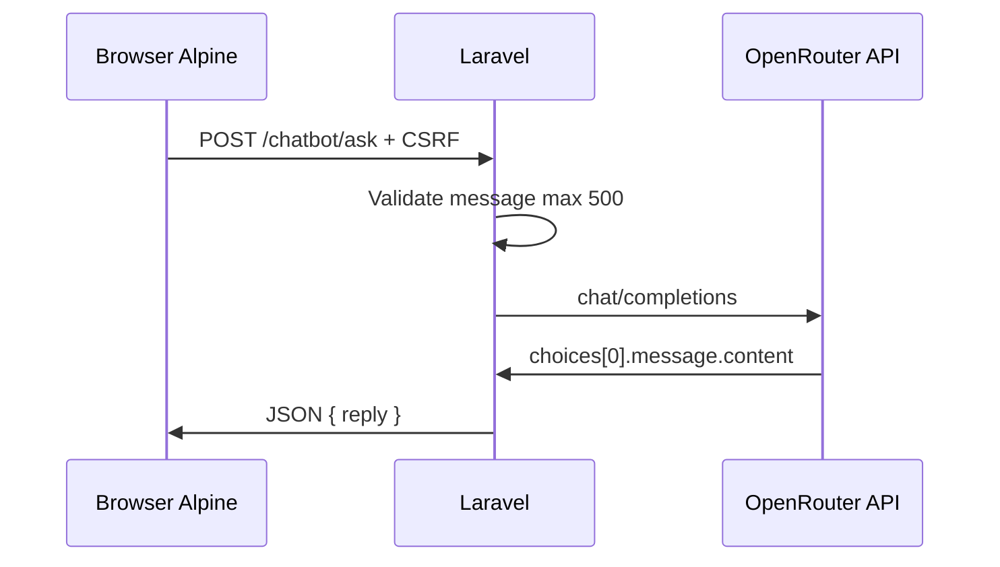

# Chatbot System

## Overview

An **AI-powered assistant** embedded in the public layout helps authenticated alumni navigate platform features. It calls the **OpenRouter API** (configured as Gemini model) from the server—API keys are never exposed to the browser.

## Components

| Layer | File |
|-------|------|
| Controller | `app/Http/Controllers/ChatbotController.php` |
| View component | `resources/views/components/chatbot.blade.php` |
| Config | `config/services.php` → `gemini` array |
| Route | `POST /chatbot/ask` (`chatbot.ask`) |

## Inclusion

`layouts/app.blade.php`:

```blade
@auth
    @include('components.chatbot')
@endauth
```

Guests do not see the chatbot.

## Request Flow



## Controller Details

### Validation

```
message: required|string|max:500
```

### System Prompt

Hard-coded in `ChatbotController` — describes:

- RMMC Alumni Platform features
- Profile verification requirements
- Routes for profile, alumni, announcements, events, gallery, posts
- Admin panel at `/admin`
- Behavior rules (concise, stay on-topic)

### HTTP Request

```php
Http::withHeaders([
    'Authorization' => 'Bearer ' . config('services.gemini.key'),
    'HTTP-Referer' => 'http://localhost',
    'X-Title' => 'Alumni Platform',
])->post('https://openrouter.ai/api/v1/chat/completions', [
    'model' => config('services.gemini.model'),
    'messages' => [ system, user ],
    'max_tokens' => 300,
    'temperature' => 0.7,
]);
```

### Response Handling

| Outcome | `reply` value |
|---------|---------------|
| Success | Model text from API |
| HTTP error | `"API Error: " . $response->body()` |
| Exception | `"Error: " . $e->getMessage()` |

**Production risk:** Raw API/exception bodies may leak to clients.

## Environment Variables

| Variable | Config key | Default |
|----------|------------|---------|
| `GEMINI_API_KEY` | `services.gemini.key` | none |
| `GEMINI_MODEL` | `services.gemini.model` | `gemini-2.0-flash` |

**Note:** `.env.example` does not document these variables yet.

## Frontend UI

Alpine `chatbot()` in `chatbot.blade.php`:

- Floating button bottom-right
- Chat window 520px height, 384px width
- Message history in DOM
- Fetch to `route('chatbot.ask')` with CSRF
- Branding: "Powered by Gemini"

## Security

| Control | Status |
|---------|--------|
| Auth required | ✓ route middleware |
| Rate limiting | ✗ not implemented |
| Input sanitization | Length only |
| Key storage | Server-side env |
| Content logging | Not implemented |

**Recommendations:**

- Add throttle middleware (e.g. `throttle:10,1`)
- Sanitize/escape model output before rendering in HTML
- Log prompts/responses without PII for audit
- Use environment-specific referer URL

## Cost & Availability

Depends on OpenRouter billing and model availability. Application degrades gracefully with error strings in chat UI—no fallback message service.

## Related Docs

- [API_REFERENCE.md](./API_REFERENCE.md)
- [DEVELOPMENT_SETUP.md](./DEVELOPMENT_SETUP.md)
- [SECURITY_AND_SCALABILITY_ANALYSIS.md](./SECURITY_AND_SCALABILITY_ANALYSIS.md)
