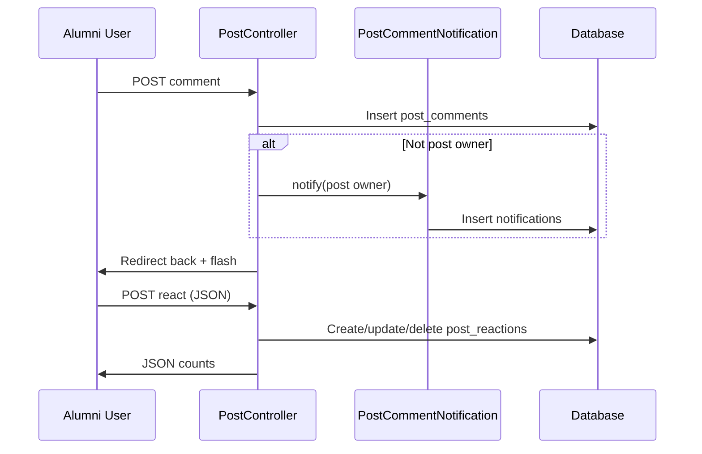

# Comments and Reactions System

## Comments

### Model: `PostComment`

**File:** `app/Models/PostComment.php`  
**Table:** `post_comments`

| Field | Type |
|-------|------|
| `post_id` | FK → posts |
| `user_id` | FK → users |
| `body` | text |

**Relationship:** ordered `latest()` on post.

### Creating Comments

**Route:** `POST /posts/{post}/comment` (`posts.comment`)  
**Controller:** `PostController@comment`

**Validation:**

```
body: required, string, min:2, max:500
```

**Notification:** If commenter ≠ post owner:

```php
$post->user->notify(new PostCommentNotification($comment));
```

### Deleting Comments

**Route:** `DELETE /comments/{comment}` (`posts.comment.delete`)  
**Rule:** `$comment->user_id === Auth::id()` else 403

### UI

Rendered on `posts/show.blade.php` with user names and delete option for own comments.

---

## Reactions

### Model: `PostReaction`

**File:** `app/Models/PostReaction.php`  
**Table:** `post_reactions`

| Type key | Display (constant) |
|----------|-------------------|
| `like` | 👍 |
| `celebrate` | 🎉 |
| `support` | ❤️ |

**Unique constraint:** `(post_id, user_id)` — one reaction slot per user.

### API Behavior

**Route:** `POST /posts/{post}/react` (`posts.react`)  
**Response:** JSON (see [API_REFERENCE.md](./API_REFERENCE.md))

**Logic:**

1. If no existing reaction → create, `reacted: true`
2. If same type → delete (toggle off), `reacted: false`
3. If different type → update type, `reacted: true`

**Counts returned:**

```json
{
  "like": 0,
  "celebrate": 0,
  "support": 0,
  "total": 0
}
```

### Frontend

Client-side `fetch()` from post show page; updates UI without full reload.

**Requires:** authenticated session + CSRF header.

---

## Data Flow Diagram



---

## What's Not Implemented

| Feature | Status |
|---------|--------|
| Comment reactions | Not present |
| Comment notifications | Only post owner notified |
| Reaction notifications | Not present |
| Nested/threaded comments | Flat list only |
| @mentions | Not present |
| Real-time updates | Polling not used for comments |

---

## Database Reference

See [DATABASE_SCHEMA.md](./DATABASE_SCHEMA.md) — `post_comments`, `post_reactions` tables.
