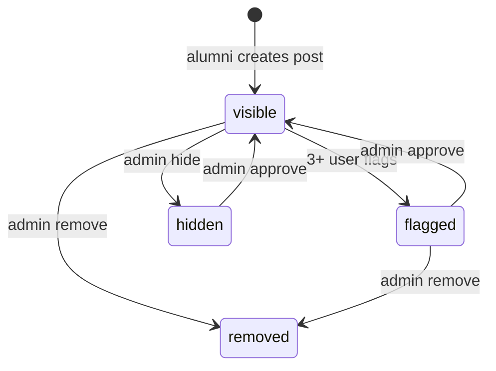

# Content Moderation System

## Overview

User-generated **posts** are moderated through:

1. **Community flagging** — alumni report posts
2. **Automatic flag marker** — 3+ flags set `is_flagged`
3. **Admin review** — Filament PostResource and PostFlagResource

There is **no automated content scanning** (AI moderation, keyword filters).

---

## Flagging (User Side)

### Model: `PostFlag`

**Constants:** `PostFlag::REASONS`

| Key | Label |
|-----|-------|
| `spam` | Spam |
| `inappropriate` | Inappropriate content |
| `misinformation` | Misinformation |
| `harassment` | Harassment |
| `other` | Other |

### Rules (`PostController@flag`)

| Rule | Enforcement |
|------|-------------|
| Cannot flag own post | Error flash |
| One flag per user per post | DB unique + check |
| `reason` required | enum validation |
| `details` optional | max 200 chars |

### Auto-flag

```php
if ($post->flags()->count() >= 3) {
    $post->update(['is_flagged' => true]);
}
```

Post remains `status=visible` until admin acts.

---

## Admin Moderation (Filament)

### PostResource (`Community` group)

**File:** `app/Filament/Resources/Posts/PostResource.php`

| Action | Effect |
|--------|--------|
| **Approve** | `status=visible`, `is_flagged=false` |
| **Hide** | `status=hidden` |
| **Remove** | `status=removed`, `is_flagged=false` |

**List features:**

- Shows flag count, comment count, flag reasons (aggregated)
- Filters by status and category
- Default sort: flagged first

### PostFlagResource (`Moderation` group)

**File:** `app/Filament/Resources/PostFlags/PostFlagResource.php`

Read-only review of individual flag records.

| Action | Effect |
|--------|--------|
| **Approve Post** | Post visible + unflagged; **deletes flag record** |
| **Remove Post** | Post removed + unflagged; **deletes flag record** |

---

## Post Status Lifecycle



---

## Public Visibility

`PostController` public actions use:

```php
Post::where('status', 'visible')  // index
abort_if($post->status !== 'visible', 404);  // show
```

Hidden/removed posts return **404** to public (not "removed" message).

---

## Gaps & Risks

| Gap | Risk |
|-----|------|
| No moderator role | All admins have full power |
| Flags don't auto-hide | Harmful content visible until admin acts |
| Approve deletes flags only | Other flags on same post cleared one-by-one in PostFlagResource |
| No audit log | No history of admin actions |
| No user ban from flagging | Repeat false reporters not limited |

---

## Recommendations

1. Auto-set `status=hidden` when `is_flagged` becomes true (configurable threshold)
2. Add `ModerationLog` model for admin actions
3. Notify admins on new flags (mail/Slack/database)
4. Queue notification delivery

See [SECURITY_AND_SCALABILITY_ANALYSIS.md](./SECURITY_AND_SCALABILITY_ANALYSIS.md).
