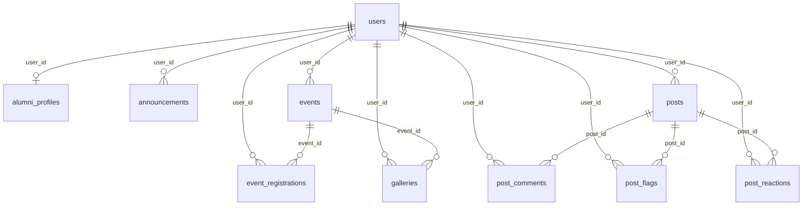

# Database Schema

## Overview

- **18 migrations** in `database/migrations/`
- **Default connection:** SQLite (`DB_CONNECTION=sqlite` in `.env.example`)
- **Compatible with MySQL/MariaDB** — standard Laravel column types
- **No pivot tables** — relationships use foreign keys on child tables
- **No separate roles table** — `users.role` enum column

## Entity Relationship Diagram

---

## Table: `users`

**Migrations:** `0001_01_01_000000_create_users_table.php`, `2026_04_15_113822_add_role_to_users_table.php`, `2026_05_14_133041_add_is_verified_to_users_table.php`, `2026_05_19_164731_add_is_suspended_to_users_table.php`

| Column | Type | Constraints | Notes |
|--------|------|-------------|-------|
| `id` | bigint PK | auto | |
| `name` | string | required | |
| `email` | string | unique | |
| `email_verified_at` | timestamp | nullable | Breeze verification |
| `password` | string | hashed | |
| `role` | enum | `admin`, `alumni` | default `alumni` |
| `is_verified` | boolean | default false | Alumni posting privilege |
| `is_suspended` | boolean | default false | Blocks login |
| `suspension_reason` | text | nullable | Shown on login failure |
| `remember_token` | string | nullable | |
| `created_at`, `updated_at` | timestamps | | |

**Indexes:** `email` unique (implicit)

---

## Table: `alumni_profiles`

**Migrations:** `2026_04_15_113828_create_alumni_profiles_table.php`, `2026_05_19_165022_add_skills_portfolio_to_alumni_profiles_table.php`

| Column | Type | FK | Notes |
|--------|------|-----|-------|
| `id` | bigint PK | | |
| `user_id` | bigint | → `users.id` CASCADE | one profile per user |
| `student_id` | string | nullable | Required for auto-verify |
| `course` | string | nullable | Required for auto-verify |
| `graduation_year` | integer | nullable | Required for auto-verify |
| `phone` | string | nullable | |
| `address` | string | nullable | |
| `current_job` | string | nullable | |
| `company` | string | nullable | |
| `linkedin_url` | string | nullable | |
| `portfolio_url` | string | nullable | Added May 2026 |
| `profile_photo` | string | nullable | Path on public disk |
| `bio` | text | nullable | |
| `skills` | string | nullable | Max 500 in validation |
| `created_at`, `updated_at` | timestamps | | |

---

## Table: `announcements`

| Column | Type | FK | Notes |
|--------|------|-----|-------|
| `id` | bigint PK | | |
| `user_id` | bigint | → `users.id` CASCADE | Admin author |
| `title` | string | | |
| `content` | text | | |
| `cover_image` | string | nullable | |
| `is_published` | boolean | default false | |
| `created_at`, `updated_at` | timestamps | | |

---

## Table: `events`

| Column | Type | FK | Notes |
|--------|------|-----|-------|
| `id` | bigint PK | | |
| `user_id` | bigint | → `users.id` CASCADE | Creator |
| `title` | string | | |
| `description` | text | | |
| `location` | string | | |
| `event_date` | datetime | | Cast to Carbon |
| `slots` | integer | default 0 | 0 = unlimited |
| `cover_image` | string | nullable | |
| `is_published` | boolean | default false | |
| `created_at`, `updated_at` | timestamps | | |

---

## Table: `event_registrations`

| Column | Type | FK | Notes |
|--------|------|-----|-------|
| `id` | bigint PK | | |
| `event_id` | bigint | → `events.id` CASCADE | |
| `user_id` | bigint | → `users.id` CASCADE | |
| `status` | enum | `pending`, `confirmed`, `cancelled` | default `pending`; app sets `confirmed` on register |
| `created_at`, `updated_at` | timestamps | | |

**Unique:** `(event_id, user_id)`

---

## Table: `galleries`

| Column | Type | FK | Notes |
|--------|------|-----|-------|
| `id` | bigint PK | | |
| `event_id` | bigint | → `events.id` CASCADE | |
| `user_id` | bigint | → `users.id` CASCADE | Uploader |
| `image_path` | string | | public disk path |
| `caption` | string | nullable | |
| `created_at`, `updated_at` | timestamps | | |

---

## Table: `posts`

**Migrations:** `2026_05_14_133234_create_posts_table.php`, `2026_05_19_141357_add_image_to_posts_table.php`

| Column | Type | FK | Notes |
|--------|------|-----|-------|
| `id` | bigint PK | | |
| `user_id` | bigint | → `users.id` CASCADE | |
| `category` | enum | see below | default `general` |
| `title` | string | | |
| `body` | text | | |
| `status` | enum | `visible`, `hidden`, `removed` | default `visible` |
| `is_flagged` | boolean | default false | Auto true at 3+ flags |
| `image_path` | string | nullable | |
| `created_at`, `updated_at` | timestamps | | |

**Category enum:** `career_update`, `achievement`, `opportunity`, `reunion`, `general`

**Indexes:** `status`, `category`, `is_flagged`

---

## Table: `post_comments`

| Column | Type | FK | Notes |
|--------|------|-----|-------|
| `id` | bigint PK | | |
| `post_id` | bigint | → `posts.id` CASCADE | |
| `user_id` | bigint | → `users.id` CASCADE | |
| `body` | text | | |
| `created_at`, `updated_at` | timestamps | | |

**Index:** `post_id`

---

## Table: `post_flags`

| Column | Type | FK | Notes |
|--------|------|-----|-------|
| `id` | bigint PK | | |
| `post_id` | bigint | → `posts.id` CASCADE | |
| `user_id` | bigint | → `users.id` CASCADE | Reporter |
| `reason` | enum | spam, inappropriate, misinformation, harassment, other | |
| `details` | string | nullable | max 200 in validation |
| `created_at`, `updated_at` | timestamps | | |

**Unique:** `(post_id, user_id)` — one flag per user per post

---

## Table: `post_reactions`

| Column | Type | FK | Notes |
|--------|------|-----|-------|
| `id` | bigint PK | | |
| `post_id` | bigint | → `posts.id` CASCADE | |
| `user_id` | bigint | → `users.id` CASCADE | |
| `type` | enum | `like`, `celebrate`, `support` | |
| `created_at`, `updated_at` | timestamps | | |

**Unique:** `(post_id, user_id)` — one reaction per user; type can change

---

## Table: `notifications`

Laravel standard (`2026_05_19_142136_create_notifications_table.php`):

| Column | Type | Notes |
|--------|------|-------|
| `id` | uuid PK | |
| `type` | string | Notification class |
| `notifiable_type`, `notifiable_id` | morphs | Usually `User` |
| `data` | text (JSON) | Payload |
| `read_at` | timestamp | nullable |
| `created_at`, `updated_at` | timestamps | |

---

## Laravel Infrastructure Tables

| Table | Migration | Purpose |
|-------|-----------|---------|
| `password_reset_tokens` | `0001_01_01_000000` | Password reset |
| `sessions` | `0001_01_01_000000` | Database sessions |
| `cache`, `cache_locks` | `0001_01_01_000001` | Database cache |
| `jobs`, `job_batches`, `failed_jobs` | `0001_01_01_000002` | Queue (unused by app code) |

---

## Role Structure (Logical, Not a Table)

| Value | Meaning |
|-------|---------|
| `admin` | Filament access, full content management |
| `alumni` | Public platform user |

Additional flags on `users`:

- `is_verified` — posting + gallery upload (with registration)
- `is_suspended` — login blocked

---

## Cascade Behavior

Deleting a `user` cascades to: profile, announcements, events, registrations, galleries, posts, comments, flags, reactions.

Deleting an `event` cascades to: registrations, galleries.

Deleting a `post` cascades to: comments, flags, reactions.

---

## Migration Order (Chronological)

1. Users, cache, jobs (Laravel defaults)
2. `role` on users
3. `alumni_profiles`, `announcements`, `events`, `event_registrations`, `galleries`
4. `is_verified` on users
5. `posts`, `post_flags`, `post_comments`
6. `image_path` on posts, `post_reactions`, `notifications`
7. `is_suspended`, `suspension_reason` on users
8. `skills`, `portfolio_url` on alumni_profiles
