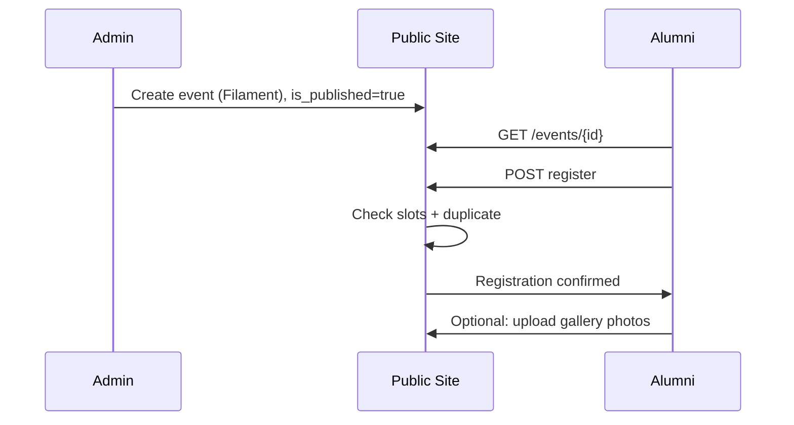

# Events and Registrations

## Overview

Admins create and publish events in Filament. Alumni browse public listings, view details, and register for upcoming events with optional capacity limits.

## Models

### `Event`

**File:** `app/Models/Event.php`

| Field | Notes |
|-------|-------|
| `user_id` | Creating admin |
| `title`, `description`, `location` | Event details |
| `event_date` | datetime cast |
| `slots` | `0` = unlimited capacity |
| `cover_image` | Optional poster |
| `is_published` | Public visibility gate |

**Relationships:**

- `registrations()` → HasMany `EventRegistration`
- `galleries()` → HasMany `Gallery`
- `user()` → BelongsTo admin

### `EventRegistration`

**File:** `app/Models/EventRegistration.php`

| Field | Notes |
|-------|-------|
| `status` | enum: `pending`, `confirmed`, `cancelled` |
| Unique | `(event_id, user_id)` |

**Public registration** always creates `status = confirmed` (despite DB default `pending`).

---

## Public Controller

**File:** `app/Http/Controllers/EventController.php`

### `index`

- **Upcoming:** published, `event_date >= now()`, ascending
- **Past:** published, `event_date < now()`, descending
- View: `events/index.blade.php`

### `show`

- `abort_if(!$event->is_published, 404)`
- Computes `$isRegistered`, `$registrationCount`, `$isPast`
- View: `events/show.blade.php`

### `register` (auth)

Checks:

1. Event not in past
2. Slots available: if `slots > 0`, count registrations `< slots
3. Not already registered

Creates `EventRegistration` with `status = confirmed`.

### `unregister` (auth)

Deletes registration row for current user + event.

---

## Routes

| Method | URI | Name | Middleware |
|--------|-----|------|------------|
| GET | `/events` | `events.index` | — |
| GET | `/events/{event}` | `events.show` | — |
| POST | `/events/{event}/register` | `events.register` | auth |
| DELETE | `/events/{event}/unregister` | `events.unregister` | auth |

---

## Admin (Filament)

### `EventResource` — group **Content**

- CRUD for events
- Fields: title, description, location, event_date, slots, cover_image, is_published
- File uploads for cover image

### `EventRegistrationResource` — group **Content**

- View/edit registrations
- Admin can change `status` (pending/confirmed/cancelled)

---

## Integration with Gallery

Verified alumni (or admins) may upload photos to an event gallery if:

- They have `event_registrations` with `status = confirmed` for that event

See [GALLERY_AND_MEDIA_SYSTEM.md](./GALLERY_AND_MEDIA_SYSTEM.md).

---

## Homepage & Search

- **Home:** latest 3 upcoming published events (`HomeController`)
- **Search:** published events matching title, description, location

---

## Workflow Diagram

---

## Edge Cases

| Case | Behavior |
|------|----------|
| `slots = 0` | Unlimited registrations |
| Past event | Register returns error flash |
| Unpublished event | 404 on show |
| Guest on show page | `$isRegistered = false` |

---

## Related Documentation

- [GALLERY_AND_MEDIA_SYSTEM.md](./GALLERY_AND_MEDIA_SYSTEM.md)
- [DATABASE_SCHEMA.md](./DATABASE_SCHEMA.md)
- [FILAMENT_ADMIN_PANEL.md](./FILAMENT_ADMIN_PANEL.md)
