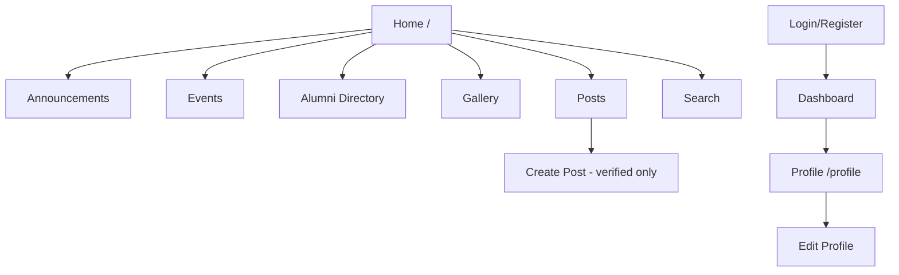

# Frontend Documentation

## Stack Summary

| Technology | Role |
|------------|------|
| **Blade** | Server-rendered HTML templates |
| **Tailwind CSS** | Utility-first styling |
| **Alpine.js** | Client-side reactivity (dropdowns, chatbot, notifications) |
| **Vite** | Bundles `resources/css/app.css` and `resources/js/app.js` |
| **Axios** | Configured in `resources/js/bootstrap.js` (CSRF-aware) |

Filament admin uses its own Livewire + Filament CSS/JS (published under `public/js/filament/`).

## Build Pipeline

**`vite.config.js`:**

```javascript
laravel({
    input: ['resources/css/app.css', 'resources/js/app.js'],
    refresh: true,
})
```

**`resources/js/app.js`:**

- Imports `./bootstrap` (Axios)
- Registers `Alpine` on `window` and calls `Alpine.start()`

**Tailwind:** `tailwind.config.js` with `@tailwindcss/forms` plugin (devDependency).

## Layouts

### Primary: `layouts/app.blade.php`

Used by all public feature pages via `@extends('layouts.app')`.

**Includes:**

- CSRF meta tag
- `@vite(['resources/css/app.css', 'resources/js/app.js'])`
- Sticky navbar with feature links
- Auth-aware right section (admin link, notification bell, profile, logout)
- Main content `@yield('content')`
- Footer with institutional branding
- Flash toast system (`session('success')`, `session('error')`)
- `@auth` chatbot include
- Inline `notificationBell()` Alpine component script

**Navigation links (desktop):**

| Label | Route name |
|-------|------------|
| Home | `home` |
| Announcements | `announcements.index` |
| Events | `events.index` |
| Directory | `alumni.index` |
| Gallery | `gallery.index` |
| Posts | `posts.index` |
| Search (icon) | `search.index` |

### Guest: `layouts/guest.blade.php`

Authentication pages (login, register, password reset).

### Breeze: `<x-app-layout>`

Used only by `resources/views/dashboard.blade.php` — includes `layouts/navigation.blade.php` (minimal: Dashboard + profile.edit link).

**Note:** `profile.edit` route points to **alumni** profile edit, not Breeze account settings.

## Reusable Blade Components

Located in `resources/views/components/`:

| Component | Purpose |
|-----------|---------|
| `application-logo` | Branding SVG |
| `auth-session-status` | Auth status messages |
| `chatbot` | Floating AI assistant (Alpine `chatbot()`) |
| `danger-button`, `primary-button`, `secondary-button` | Form buttons |
| `dropdown`, `dropdown-link` | User menu (Breeze layout) |
| `input-error`, `input-label`, `text-input` | Form fields |
| `modal` | Dialog wrapper |
| `nav-link`, `responsive-nav-link` | Navigation items |

View component classes: `app/View/Components/AppLayout.php`, `GuestLayout.php`.

## Feature Views

| Directory | Views | Notes |
|-----------|-------|-------|
| `home.blade.php` | Landing hero, stats, previews | |
| `alumni/` | `index`, `profile`, `edit` | Directory cards, profile form |
| `announcements/` | `index`, `show` | |
| `events/` | `index`, `show` | Register/unregister forms |
| `gallery/` | `index`, `show` | Upload form, lightbox patterns |
| `posts/` | `index`, `show`, `create`, `edit` | Reactions via fetch |
| `search/` | `index` | Multi-section results |
| `notifications/` | `index` | Paginated list |
| `auth/` | login, register, verify, etc. | Breeze templates |

## Tailwind Design Conventions

- **Primary brand:** `blue-700`, `blue-50` active nav states
- **Admin accent:** `indigo-600` (admin panel button)
- **Cards:** `bg-white rounded-xl shadow-sm border border-gray-100`
- **Responsive:** `hidden md:flex`, grid `grid-cols-1 md:grid-cols-3`
- **Dark mode classes:** Present in Breeze components only (dashboard/nav), not main app layout

## Alpine.js Interactions

### Notification bell (`layouts/app.blade.php`)

```javascript
function notificationBell() {
    return {
        open: false,
        unread: 0,
        notifications: [],
        init() { this.fetchNotifications(); setInterval(..., 30000); },
        async fetchNotifications() { fetch('/notifications/unread') },
        async markRead() { fetch('/notifications/mark-read', { method: 'POST', ... }) }
    }
}
```

### Chatbot (`components/chatbot.blade.php`)

- `x-data="chatbot()"` — toggle window, message list, typing state
- Posts to `route('chatbot.ask')` with CSRF token
- Fixed position `bottom-6 right-6 z-50`

### Post reactions (`posts/show.blade.php`)

Typically uses `fetch()` to `POST /posts/{post}/react` with JSON response for updated counts.

### Mobile navigation

Breeze `navigation.blade.php` uses `x-data="{ open: false }"` for hamburger menu (dashboard only).

## Navigation Flow



## Responsive Structure

- Navbar collapses feature links on small screens (links `hidden md:flex` — **mobile nav for main layout is limited**; users rely on footer links)
- Grids adapt `grid-cols-1` → `md:grid-cols-3`
- Chatbot fixed width `w-96` may overflow on very small screens

## Assets & Images

Uploaded images referenced via `Storage::url()` or `/storage/{path}` after `storage:link`.

## Filament Frontend (Admin)

Separate from Vite alumni bundle. Served through Filament's asset pipeline at `/admin`.

## Developer Workflow

```bash
npm run dev    # Vite HMR during development
npm run build  # Production assets to public/build
```

Included in `composer dev` script alongside `php artisan serve`.

## Known Frontend Inconsistencies

| Issue | Detail |
|-------|--------|
| Dual layouts | Breeze dashboard vs custom `layouts/app` |
| Orphan Breeze views | `resources/views/profile/*` not linked in routes |
| `GET /posts/create` | Public route; UI only shows button when auth+verified |

See [FRONTEND_DOCUMENTATION.md](./FRONTEND_DOCUMENTATION.md) companion: [PROJECT_PROGRESS_AND_FUTURE_ROADMAP.md](./PROJECT_PROGRESS_AND_FUTURE_ROADMAP.md).
