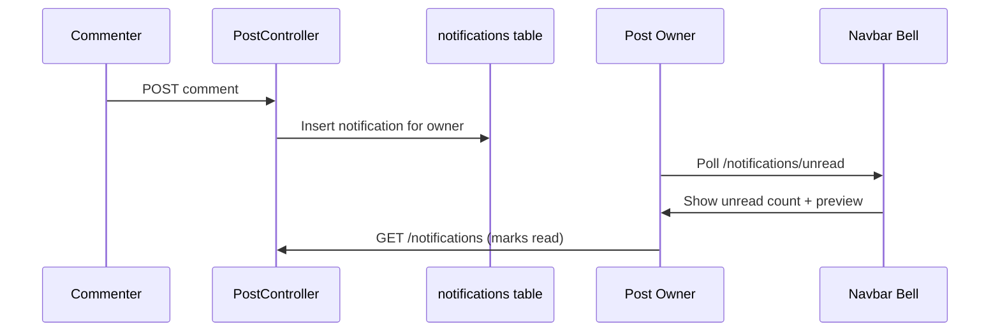

# Notifications System

## Overview

In-app notifications use Laravel's **database notification channel**. Only **post comment** events generate notifications today.

## Database

**Table:** `notifications` (UUID primary key)  
**Migration:** `2026_05_19_142136_create_notifications_table.php`

Standard Laravel schema: `type`, `notifiable` morphs, `data` JSON, `read_at`.

## Notification Class

**File:** `app/Notifications/PostCommentNotification.php`

### Channels

```php
public function via(object $notifiable): array
{
    return ['database'];
}
```

**Not queued** — no `ShouldQueue` interface.

### Payload (`toArray`)

| Key | Content |
|-----|---------|
| `message` | "{name} commented on your post." |
| `post_id` | Post ID for deep link |
| `post_title` | Post title |
| `commenter` | Commenter display name |

## Trigger

**File:** `app/Http/Controllers/PostController.php` — `comment()` method

```php
if ($post->user_id !== Auth::id()) {
    $post->user->notify(new PostCommentNotification($comment));
}
```

Self-comments do not notify.

## Controller

**File:** `app/Http/Controllers/NotificationController.php`

| Method | Route | Behavior |
|--------|-------|----------|
| `index` | GET `/notifications` | Paginate 20; **marks all read** on page load |
| `unread` | GET `/notifications/unread` | JSON: latest 5 + unread count |
| `markRead` | POST `/notifications/mark-read` | JSON: mark all read |

## Frontend (Navbar Bell)

**Location:** `resources/views/layouts/app.blade.php`

Alpine component `notificationBell()`:

- Polls `/notifications/unread` every **30 seconds**
- Dropdown links to `/posts/{post_id}` from notification data
- `markRead()` on bell click

Full list: `resources/views/notifications/index.blade.php`

## Flow Diagram



## What's Not Notified

| Event | Notified? |
|-------|-----------|
| New post | No |
| Reaction | No |
| Post flagged | No |
| Event registration | No |
| New announcement | No |
| Admin moderation | No |

## Email / Push

`MAIL_MAILER=log` in `.env.example` — email not used for notifications.

## Production Improvements

1. Implement `ShouldQueue` on notification class
2. Add `database` + `mail` channels for digest emails
3. Don't mark all read when merely opening index (use per-notification read)
4. Add notification preferences per user
5. Admin alerts for flagged posts

## Related Docs

- [API_REFERENCE.md](./API_REFERENCE.md)
- [COMMENTS_AND_REACTIONS_SYSTEM.md](./COMMENTS_AND_REACTIONS_SYSTEM.md)
