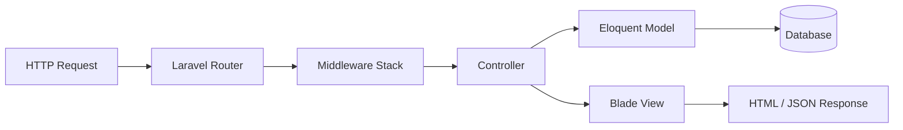

# Project Architecture

## Laravel MVC in This Codebase



| MVC Layer | Implementation |
|-----------|----------------|
| **Model** | `app/Models/*` — Eloquent entities, relationships, scopes, constants |
| **View** | `resources/views/*` — Blade templates, components, layouts |
| **Controller** | `app/Http/Controllers/*` — HTTP handling, validation, authorization checks |

Filament adds a **parallel admin MVC path**: Filament Resources bind forms/tables directly to models without separate public controllers.

## Application Layers

```
┌─────────────────────────────────────────────────────────────┐
│                     Presentation Layer                       │
│  Blade (public) │ Filament/Livewire (admin) │ Vite assets   │
└────────────────────────────┬────────────────────────────────┘
                             │
┌────────────────────────────▼────────────────────────────────┐
│                   Application Layer                          │
│  HTTP Controllers │ Form Requests │ Notifications            │
│  Filament Resources │ Widgets                                  │
└────────────────────────────┬────────────────────────────────┘
                             │
┌────────────────────────────▼────────────────────────────────┐
│                      Domain Layer                            │
│  Eloquent Models │ Model scopes │ Enums (DB-level)            │
└────────────────────────────┬────────────────────────────────┘
                             │
┌────────────────────────────▼────────────────────────────────┐
│                   Infrastructure Layer                       │
│  SQLite/MySQL │ Session store │ Public disk │ Queue (jobs)   │
│  OpenRouter API (chatbot)                                    │
└─────────────────────────────────────────────────────────────┘
```

## Request Lifecycle (Public Site)

1. **Entry** — `public/index.php` bootstraps Laravel.
2. **Routing** — `bootstrap/app.php` registers `routes/web.php` (and `routes/console.php` for CLI).
3. **Middleware** — Route-level middleware (`auth`, `verified`, `guest`) and global web stack (cookies, session, CSRF).
4. **Controller action** — Resolves route parameters (e.g. `{post}` via implicit binding).
5. **Authorization** — Inline checks (`abort_if`, `Auth::user()->is_verified`, role checks).
6. **Data access** — Eloquent queries with eager loading where used.
7. **Response** — `return view(...)` or `return response()->json(...)`.

### Middleware Configuration

`bootstrap/app.php` does not register custom middleware aliases. Standard Laravel middleware is applied via route definitions:

```php
// Example from routes/web.php
Route::middleware(['auth'])->group(function () { ... });
Route::get('/dashboard', ...)->middleware(['auth', 'verified']);
```

**No custom middleware classes** exist under `app/Http/Middleware/`.

## Request Lifecycle (Filament Admin)

1. Request to `/admin/*`.
2. Filament middleware stack in `AdminPanelProvider` (session, CSRF, `Authenticate`).
3. `User::canAccessPanel()` — only `role === 'admin'`.
4. Resource/page/widget renders via Livewire.

## Frontend / Backend Interaction

| Pattern | Used for |
|---------|----------|
| **Full page POST/PUT** | Profile update, post create, event register, gallery upload |
| **Fetch + JSON** | Post reactions, chatbot, notification bell |
| **Session flash** | Success/error toasts in `layouts/app.blade.php` |
| **CSRF** | Meta tag + `@csrf` on forms; fetch sends `X-CSRF-TOKEN` |

There is **no SPA** and **no separate API application**.

## Service Providers

| Provider | File | Role |
|----------|------|------|
| `AppServiceProvider` | `app/Providers/AppServiceProvider.php` | Empty register/boot hooks |
| `AdminPanelProvider` | `app/Providers/Filament/AdminPanelProvider.php` | Filament panel config |

Registered in `bootstrap/providers.php`.

## Missing Architectural Patterns (By Design / Gap)

| Pattern | Status |
|---------|--------|
| `app/Services/` | Not present |
| Laravel Policies | Not present |
| API Resources / Sanctum | Not present |
| Event/Listener domain events | Only Breeze `Registered` event |
| Repository pattern | Not used |

## Dual Layout Strategy

| Layout | Path | Used by |
|--------|------|---------|
| Custom alumni layout | `resources/views/layouts/app.blade.php` | Home, posts, events, gallery, alumni, search |
| Breeze app layout | `resources/views/layouts/app.blade.php` via `<x-app-layout>` | `dashboard.blade.php` only |
| Guest layout | `resources/views/layouts/guest.blade.php` | Auth pages |

See [FRONTEND_DOCUMENTATION.md](./FRONTEND_DOCUMENTATION.md) for layout details.

## File Storage Architecture

Uploads use the **`public` disk** (`storage/app/public`):

| Directory | Content |
|-----------|---------|
| `profile-photos/` | Alumni avatars |
| `post-images/` | Post attachments |
| `gallery/` | Event gallery images |

URLs served via `php artisan storage:link` → `public/storage`.

## Queue & Jobs

- **Migration:** `jobs` table exists (`0001_01_01_000002_create_jobs_table.php`).
- **Default queue:** `database` in `.env.example`.
- **Application jobs:** No custom `app/Jobs` classes.
- **Notifications:** Synchronous database channel (not queued).

## Configuration-Driven Behavior

| Config file | Relevance |
|-------------|-----------|
| `config/auth.php` | Web guard, user provider |
| `config/filesystems.php` | `public` disk for media |
| `config/services.php` | `gemini.key`, `gemini.model` for chatbot |
| `config/session.php` | Database sessions (default in `.env.example`) |

## Scalability Note (Architectural)

The application is a **single deployable unit** suitable for small-to-medium alumni communities. Horizontal scaling would require shared session storage, centralized file storage (S3), and queue workers—see [SECURITY_AND_SCALABILITY_ANALYSIS.md](./SECURITY_AND_SCALABILITY_ANALYSIS.md).
