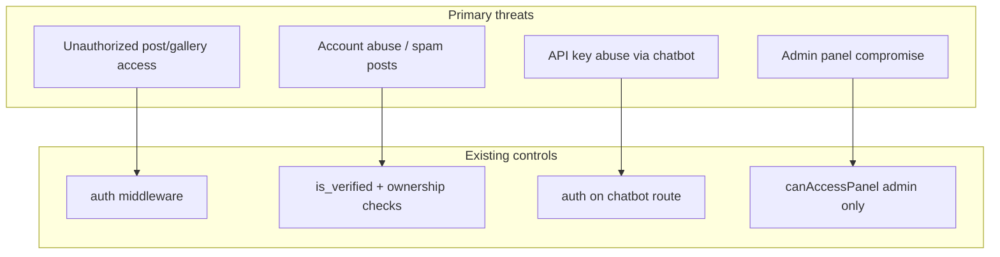

# Security and Scalability Analysis

## Architectural Strengths

| Strength | Detail |
|----------|--------|
| **Framework defaults** | Laravel CSRF, password hashing, session regeneration on login |
| **Published content gating** | `abort_if` on unpublished announcements/events/posts |
| **Filament isolation** | Separate admin auth gate via `canAccessPanel()` |
| **Upload validation** | MIME/size limits on profile, post, gallery images |
| **Flag uniqueness** | Prevents duplicate reports per user per post |
| **Suspension enforcement** | Checked immediately after successful authentication |
| **Server-side chatbot** | API key not exposed to browser |
| **Foreign key cascades** | Consistent data cleanup on user/post/event deletion |

---

## Technical Debt

| Item | Impact |
|------|--------|
| No Policy classes | Authorization scattered; easy to miss checks on new routes |
| No service layer | Harder to unit test business rules |
| Breeze/profile route overlap | `profile.edit` → alumni, orphan account settings views |
| `GET /posts/create` without `auth` | Error if guest hits URL directly |
| Chatbot error leakage | API/exception bodies returned to client |
| `.env.example` incomplete | Missing `GEMINI_*`, storage guidance |
| Default README | No project-specific onboarding |
| Minimal seeder | No demo admin/alumni dataset |
| Sync notifications | Request latency on comment |

---

## Security Concerns

### High priority

| Concern | Location | Recommendation |
|---------|----------|----------------|
| **Unauthenticated post create route** | `routes/web.php` | Add `auth` middleware to `posts.create` |
| **Chatbot error disclosure** | `ChatbotController` | Generic user message; log details server-side |
| **No rate limit on chatbot** | `chatbot.ask` | Add `throttle` middleware |
| **Public storage URLs** | `public` disk | Acceptable for alumni photos; document privacy policy |
| **Inline authorization** | Controllers | Introduce Policies for posts, gallery, events |

### Medium priority

| Concern | Detail | Recommendation |
|---------|--------|----------------|
| **Email verification not enforced** | Only `/dashboard` uses `verified` | Require `verified` for posting or remove unused middleware |
| **Admin self-registration** | Anyone can register as alumni | Invitation-only registration or admin approval queue |
| **Mass assignment** | Models use `$fillable` correctly | Audit Filament forms for privileged fields |
| **XSS in posts/comments** | Blade `{{ }}` escapes by default | Ensure `{!! !!}` not used for user HTML |
| **Session driver** | Database sessions | Use Redis in production; secure cookie flags |

### Low priority

| Concern | Detail |
|---------|--------|
| Open redirect | Breeze intended redirect — validate paths |
| IDOR on comments | Mitigated by ownership check on delete |
| Filament brute force | Use server-level rate limit on `/admin` |

---

## Scalability Limitations

### Application tier

| Limitation | Threshold | Mitigation |
|------------|-----------|------------|
| Monolithic deploy | Single codebase | Horizontal scaling behind load balancer |
| Session stickiness | DB/ file sessions | Redis centralized sessions |
| Sync notifications | Comment volume | Queue `ShouldQueue` notifications |
| N+1 queries | Some lists eager-load | Audit with Laravel Debugbar / Telescope |
| Full-text search | `LIKE %query%` | Meilisearch/Algolia/PostgreSQL FTS |
| Polling notifications | 30s interval all users | WebSockets or SSE (Laravel Reverb) |

### Storage tier

| Limitation | Mitigation |
|------------|------------|
| Local `public` disk | S3 + CDN for images |
| No image processing | Resize on upload (Intervention Image) |
| Unbounded gallery uploads | Per-user/event quotas |

### Database tier

| Table | Growth risk |
|-------|-------------|
| `notifications` | Unbounded — archive job |
| `post_comments`, `post_reactions` | High on active communities |
| `sessions` | Clean expired sessions |

SQLite suitable for development only; **MySQL/PostgreSQL** for production.

---

## Production Improvement Recommendations

### Security hardening

1. Enforce HTTPS and `SESSION_SECURE_COOKIE=true`
2. Add CSP headers for XSS defense in depth
3. Implement Laravel Policies (`PostPolicy`, `GalleryPolicy`)
4. Rate-limit login, chatbot, flag endpoints
5. Hide Filament from public discovery (`/admin` IP allowlist optional)
6. Enable `composer audit` in CI
7. Sanitize chatbot output (HTML escape)

### Operational

1. Centralized logging (structured JSON)
2. Error tracking (Sentry/Bugsnag)
3. Backup automation for DB + storage
4. Health checks beyond `/up` (DB, Redis, storage writable)

### Performance

1. `php artisan config:route:view:cache` in deploy
2. Redis for cache/session
3. CDN for `/storage` assets
4. Database indexes review (already on posts.status, category, is_flagged)
5. Queue workers for mail/notifications

### Code quality

1. Expand PHPUnit coverage for domain rules
2. CI pipeline: test + pint + build
3. Larastan static analysis
4. Document and seed admin user in `DatabaseSeeder`

---

## Optimization Opportunities

| Area | Quick win |
|------|-----------|
| Search | Add composite indexes on frequently searched columns |
| Homepage | Cache alumni count / announcement list 5 minutes |
| Post feed | Cache category counts |
| Images | Generate thumbnails on upload |
| Filament | Eager load relationships in resource queries (partially done in PostResource) |

---

## Threat Model Summary

---

## Related Documentation

- [AUTHENTICATION_AND_AUTHORIZATION.md](./AUTHENTICATION_AND_AUTHORIZATION.md)
- [DEPLOYMENT_GUIDE.md](./DEPLOYMENT_GUIDE.md)
- [PROJECT_PROGRESS_AND_FUTURE_ROADMAP.md](./PROJECT_PROGRESS_AND_FUTURE_ROADMAP.md)
