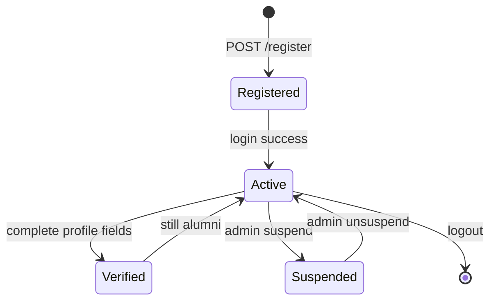

# User and Role System

## User Model

**File:** `app/Models/User.php`  
**Table:** `users`  
**Traits:** `HasFactory`, `Notifiable`  
**Interfaces:** `Filament\Models\Contracts\FilamentUser`

### Fillable Attributes

```php
'name', 'email', 'password', 'role',
'is_verified', 'is_suspended', 'suspension_reason'
```

### Casts

| Attribute | Cast |
|-----------|------|
| `email_verified_at` | datetime |
| `password` | hashed |
| `is_verified` | boolean |
| `is_suspended` | boolean |

### Helper Methods

| Method | Returns true when |
|--------|-------------------|
| `isAdmin()` | `role === 'admin'` |
| `isSuspended()` | `is_suspended === true` |
| `canAccessPanel($panel)` | `role === 'admin'` |

---

## Roles

Stored as DB **enum** on `users.role`:

| Role | Default | Description |
|------|---------|-------------|
| `alumni` | ✓ (migration default) | Standard community member |
| `admin` | | Institution staff; Filament access |

**There is no moderator role.** Content moderation is performed by admins in Filament.

### Role Assignment

| Path | How role is set |
|------|-----------------|
| Self-registration | DB default `alumni` |
| Filament UserResource | Admin selects role on create/edit |
| Seeder/factory | Configurable |

---

## Status Flags

### `is_verified` (Alumni trust tier)

| Set by | Condition |
|--------|-----------|
| Application | Profile update with `course`, `graduation_year`, `student_id` |
| Admin | Manual toggle in Filament |

**Privileges when true:**

- Create/edit/delete own posts
- Upload gallery photos (if event registration confirmed)
- UI shows verified badge on posts/directory

### `is_suspended`

| Set by | Filament Suspend action |
|--------|-------------------------|
| Cleared by | Unsuspend action |

**Effect:** User cannot remain logged in; login attempt shows `suspension_reason`.

### `email_verified_at`

Managed by Laravel Breeze email verification flow. **Limited enforcement** — only `dashboard` route requires `verified` middleware.

---

## Relationships

```php
$user->alumniProfile()      // HasOne
$user->announcements()      // HasMany
$user->events()             // HasMany (created events)
$user->eventRegistrations() // HasMany
$user->galleries()          // HasMany (uploads)
$user->posts()              // HasMany
$user->postFlags()          // HasMany
$user->postComments()       // HasMany
```

---

## Filament User Management

**Resource:** `app/Filament/Resources/Users/UserResource.php`

### Admin capabilities

- Create users with password
- Set role, verification, suspension
- **Suspend** alumni with required reason (modal form)
- **Unsuspend** with confirmation

### Table columns

Name, email, role (badge), verified icon, suspended icon, created_at.

---

## User Lifecycle Diagram



---

## Notifications

Users receive database notifications via Laravel `Notifiable` trait (e.g. `PostCommentNotification`).

---

## Factory & Seeding

**Factory:** `database/factories/UserFactory.php`  
**Seeder:** `DatabaseSeeder` creates one test user — no role/admin seed documented.

### Recommended seed for development

Create at least:

1. Admin: `role=admin`, known password
2. Sample alumni with/without `is_verified`
3. Alumni with complete `AlumniProfile`

---

## Related Documentation

- [AUTHENTICATION_AND_AUTHORIZATION.md](./AUTHENTICATION_AND_AUTHORIZATION.md)
- [ALUMNI_PROFILE_SYSTEM.md](./ALUMNI_PROFILE_SYSTEM.md)
- [FILAMENT_ADMIN_PANEL.md](./FILAMENT_ADMIN_PANEL.md)
