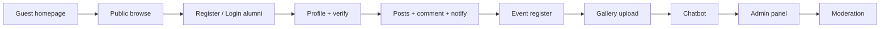

# System Demonstration Flow

**Purpose:** Step-by-step live demo guide — what to click, what to say, and in what order.  
**Recommended total demo time:** 12–18 minutes (after or during narration)  
**Prerequisites:** Migrated database, `storage:link`, at least one admin and two alumni test accounts (one verified, one not).

---

## Opening Script — Read This Before You Start the Demo

**Use:** Stand at the screen (or share your display), read this aloud once, then begin Segment 1.  
**Duration:** about 60–90 seconds.

---

### 1. Greet and set context (15–20 sec)

> Good [morning/afternoon], everyone.  
>  
> I will now walk you through the **Alumni Platform** — a web application we built for **Ramon Magsaysay Memorial College** so graduates can stay connected to the school and to each other.  
>  
> This is a **live demonstration** of the working system, not slides only. You will see the public alumni site and the admin panel exactly as users would experience them.

---

### 2. State what you will show (20–25 sec)

> In the next **[12–18] minutes**, I will demonstrate four things in order.  
>  
> **First**, what a **guest or new visitor** sees without logging in.  
> **Second**, the **alumni journey** — profile, verification, posts, comments, and notifications.  
> **Third**, **events and galleries** — registration and photo uploads.  
> **Fourth**, the **admin panel** — where school staff publish announcements, manage events, and moderate community content.  
>  
> I will also briefly show the **AI chatbot** that helps alumni navigate the platform.

---

### 3. Confirm the system is ready (10–15 sec) — optional but professional

> Before I click anything: the application is running locally on Laravel, the database is migrated, and I have prepared test accounts — one **admin**, and two **alumni** users so you can see the difference between a new member and a **verified** member who can post.

*If something is open behind you, you can add:*

> I have the homepage loaded at the root URL. I will start as a **guest**, then log in as an alumnus.

---

### 4. One-sentence architecture (10 sec) — optional for technical panels

> Technically, this is one Laravel application with a Blade front end for alumni and a Filament admin panel at `/admin`, sharing the same database and security rules.

*Skip this line for non-technical audiences.*

---

### 5. Transition into the demo (5–10 sec)

> I will begin on the **homepage**. Please watch the navigation bar — Home, Announcements, Events, Directory, Gallery, and Posts — because we will use each of these during the demo.  
>  
> Let’s start.

**→ Now open `http://127.0.0.1:8000/` and continue to [Segment 1: Guest Public Experience](#segment-1-guest-public-experience).**

---

### Quick mental checklist (do not read aloud)

| Ready? | Item |
|:------:|------|
| ☐ | `php artisan serve` running |
| ☐ | Homepage loads without error |
| ☐ | Admin + 2 alumni accounts exist |
| ☐ | At least 1 published announcement and 1 upcoming event |
| ☐ | Incognito window ready for guest (optional) |
| ☐ | Second tab: `/admin` logged in as admin (optional, for end) |
| ☐ | `GEMINI_API_KEY` set if showing chatbot |

---

### If the panel asks a question before you start

| Question | Short answer |
|----------|----------------|
| “Is this deployed online?” | “Today’s demo is on a local development server; the same codebase is deployment-ready for a school server or cloud hosting.” |
| “Can alumni see admin tools?” | “No. Only users with the admin role can access `/admin`.” |
| “Is data real?” | “This is test data prepared for the demonstration.” |

---

## Pre-Demo Checklist

| Step | Action |
|------|--------|
| 1 | Start server: `php artisan serve` |
| 2 | Build assets: `npm run build` (or `npm run dev` running) |
| 3 | Confirm `php artisan storage:link` |
| 4 | Seed or create: **Admin**, **Alumni A** (verified), **Alumni B** (unverified) |
| 5 | Publish 1 announcement, 1 upcoming event (with slots), 1 visible post |
| 6 | Set `GEMINI_API_KEY` if demonstrating chatbot |
| 7 | Open browser: incognito for guest, normal for logged-in users |
| 8 | Optional second tab pre-logged as admin at `/admin` |

---

## Suggested Presentation Sequence



| Order | Segment | Duration |
|-------|---------|----------|
| 1 | Guest public experience | 2–3 min |
| 2 | Alumni registration & profile | 3–4 min |
| 3 | Social: posts, comments, reactions | 3–4 min |
| 4 | Events & gallery | 2–3 min |
| 5 | Notifications & search | 1–2 min |
| 6 | Chatbot | 1–2 min |
| 7 | Admin panel & moderation | 3–4 min |

---

## Segment 1: Guest Public Experience

### 1.1 Homepage

| Action | Click / URL |
|--------|-------------|
| Open | `http://127.0.0.1:8000/` |

**Explain:**

- “This is the public landing page for Ramon Magsaysay Memorial College alumni.”
- Point out **stats**: registered alumni count, upcoming events, latest announcements.
- “Guests can explore without logging in — this encourages discovery.”

**Show:** Scroll to announcement previews and upcoming event cards; click **View all** on one section.

---

### 1.2 Announcements (read-only)

| Action | Click |
|--------|-------|
| Nav | **Announcements** |
| Open | Any published announcement |

**Explain:**

- “Official news is admin-authored only — alumni cannot post fake institutional news.”
- “Unpublished content is hidden with a 404 — not a permission error.”

---

### 1.3 Events (browse only)

| Action | Click |
|--------|-------|
| Nav | **Events** |

**Explain:**

- Upcoming vs past events separation.
- “Registration requires login — we’ll demonstrate that next.”

---

### 1.4 Alumni directory & posts (public read)

| Action | Click |
|--------|-------|
| Nav | **Directory** |
| Try search | Enter a name or course |
| Nav | **Posts** |

**Explain:**

- Directory search across profile fields.
- Posts feed shows only **visible** posts; category filter if time permits.

---

## Segment 2: Alumni User Demonstration

### 2.1 Registration

| Action | Click |
|--------|-------|
| Nav | **Register** |
| Submit | New test user OR use pre-created **Alumni B** (unverified) |

**Explain:**

- “Default role is alumni — not admin.”
- “Profile row is created on first profile save, not at registration.”

**Optional:** Show redirect to `/dashboard` (Breeze stub) — mention future redirect to profile/home.

---

### 2.2 Login as unverified alumni

| Action | Click |
|--------|-------|
| Login | Alumni B credentials |
| Nav | **Posts** |

**Explain:**

- “Without verification, the UI prompts **Complete Profile to Post** — not a hard-to-find rule.”
- Click that button → lands on **profile edit**.

---

### 2.3 Complete profile → auto-verify

| Action | Click |
|--------|-------|
| Nav / URL | **Profile** or avatar → profile |
| Click | Edit profile |
| Fill | `course`, `graduation_year`, `student_id` (+ optional photo, skills, portfolio) |
| Submit | Save |

**Explain:**

- “Verification is automatic when academic identity fields are complete — scalable for the school.”
- Show success message; return to **Posts** — **+ New Post** should appear.

---

### 2.4 Create a post

| Action | Click |
|--------|-------|
| Posts | **+ New Post** |
| Fill | Title, category, body; optional image |
| Submit | Publish |

**Explain:**

- Categories map to alumni use cases: career, achievement, opportunity, reunion.
- Image stored on public disk under `post-images/`.

**Show:** Post appears on feed with category badge.

---

## Segment 3: Posting, Commenting, Reactions, Flagging

### 3.1 Second alumni account (Alumni A)

| Action | Click |
|--------|-------|
| Logout | Logout |
| Login | Alumni A (verified) |
| Open | The post Alumni B created |

**Explain:**

- “Engagement is open to all logged-in alumni, not only verified — comments build community.”

---

### 3.2 Comment

| Action | Click |
|--------|-------|
| Type | Comment on post |
| Submit | Post comment |

**Explain:**

- Post owner receives **database notification** (not email in MVP).

---

### 3.3 Reaction

| Action | Click |
|--------|-------|
| Click | Like / Celebrate / Support |

**Explain:**

- “AJAX JSON endpoint — one reaction per user, toggle or change type.”
- Counts update without full page reload.

---

### 3.4 Notifications demo

| Action | Click |
|--------|-------|
| Logout → Login | **Alumni B** (post owner) |
| Click | Bell icon 🔔 |

**Explain:**

- Dropdown shows comment notification with link to post.
- “Polls every 30 seconds; opening list marks notifications read.”
- Optional: **View all** → `/notifications`

---

### 3.5 Flagging (optional — use test post)

| Action | Click |
|--------|-------|
| Login | Alumni A |
| Open | Another user’s post |
| Submit | Flag with reason |

**Explain:**

- Cannot flag own post; one flag per user.
- “Three flags auto-mark post for admin review — community signal, not auto-delete.”

---

## Segment 4: Event Registration Demo

### 4.1 Register for event

| Action | Click |
|--------|-------|
| Login | Verified alumni (A or B) |
| Nav | **Events** |
| Open | Upcoming published event |
| Click | **Register** (or equivalent button on show page) |

**Explain:**

- Server checks: not past, not full, not duplicate.
- Registration stored as **confirmed**.

**Show:** Success flash; registered state on page.

---

### 4.2 Slot limit demo (optional)

**Explain (no click needed if not seeded):**

- “If `slots` is set and full, registration returns an error message — capacity enforced server-side.”

---

### 4.3 Unregister (optional)

| Action | Click |
|--------|-------|
| Click | Unregister |

**Explain:** Deletes registration row; gallery upload permission revoked for that event.

---

## Segment 5: Gallery / Media Demo

| Action | Click |
|--------|-------|
| Nav | **Gallery** |
| Open | Event with photos OR event you registered for |
| Upload | Select 1–3 images (if `canUpload` true) |
| Submit | Upload |

**Explain:**

- “Verified + confirmed registration required for alumni; admins can always upload.”
- Captions optional; files under `storage/app/public/gallery`.

**Show:** New photos in grid; mention delete own photo.

---

## Segment 6: Global Search

| Action | Click |
|--------|-------|
| Nav | 🔍 Search |
| Enter | 2+ characters matching alumni, post, or event |

**Explain:**

- Cross-entity search for quick discovery.
- “Uses SQL LIKE in MVP; roadmap includes dedicated search engine.”

---

## Segment 7: Chatbot Demo

| Action | Click |
|--------|-------|
| Login | Any alumni |
| Click | Floating chatbot button (bottom-right) |
| Ask | “How do I become verified?” or “How do I register for an event?” |

**Explain:**

- “Authenticated only — API key stays on server.”
- “System prompt describes real features — reduces misleading answers.”

**If API fails:** Explain gracefully — env key required; error handling is a documented improvement.

---

## Segment 8: Admin Demonstration Flow

### 8.1 Admin login

| Action | Click |
|--------|-------|
| Login | Admin account |
| Click | **⚙️ Admin Panel** OR go to `/admin` |

**Explain:**

- Non-admin users blocked by `canAccessPanel()`.

---

### 8.2 Dashboard widgets

**Explain while viewing:**

- Total alumni, verified count, posts (+ flagged count in description).
- Upcoming events, registrations, announcements.
- Alumni growth chart — last 6 months.

---

### 8.3 Create announcement

| Action | Click |
|--------|-------|
| Nav | Content → **Announcements** |
| Click | Create |
| Fill | Title, content, cover; toggle **Published** |
| Save | |

**Explain:** Appears on public site immediately when published.

---

### 8.4 Create event

| Action | Click |
|--------|-------|
| Nav | Content → **Events** |
| Create | Set date future, slots, published |
| Save | |

**Explain:** Alumni registration demo now has fresh event if needed.

---

### 8.5 User management

| Action | Click |
|--------|-------|
| Nav | Users & Profiles → **Users** |
| Open | Alumni B |
| Toggle | Verified / or demonstrate **Suspend** with reason |

**Explain:**

- Suspension blocks login with reason message.
- “Institutional control without deleting history.”

---

### 8.6 Post moderation

| Action | Click |
|--------|-------|
| Nav | Community → **Posts** |
| Show | Flagged posts sort |
| Action | **Hide**, **Remove**, or **Approve** |

**Explain:** Status: visible, hidden, removed.

---

### 8.7 Flag review (if flags exist)

| Action | Click |
|--------|-------|
| Nav | Moderation → **Flagged Posts** |
| Action | Approve post or Remove post |

**Explain:** Clears flag record; documents moderation workflow.

---

### 8.8 Event registrations & gallery (admin)

| Action | Click |
|--------|-------|
| Nav | Event Registrations | View list |
| Nav | Galleries | Optional CRUD |

**Explain:** Admin oversight of attendance and media.

---

## Segment 9: Closing the Demo

**Summarize in 30 seconds:**

1. Public discovery → registration → verified engagement  
2. Events and gallery tie participation to memories  
3. Social layer with notifications and moderation  
4. Admin panel for full institutional control  

**Invite questions** — refer to [PANEL_DEFENSE_NOTES.md](./PANEL_DEFENSE_NOTES.md).

---

## Troubleshooting During Live Demo

| Problem | Quick fix |
|---------|-------------|
| Images 404 | `php artisan storage:link` |
| Cannot access admin | Check `users.role = admin` |
| No New Post button | Complete profile verification fields |
| Chatbot error | Check `GEMINI_API_KEY` in `.env` |
| Empty gallery index | Upload at least one photo to an event |
| 419 CSRF on fetch | Refresh page to refresh token |

---

## Demo Account Suggestion (Tinker)

```php
// Admin
User::create(['name'=>'Admin','email'=>'admin@school.edu','password'=>bcrypt('password'),'role'=>'admin','is_verified'=>true]);

// Alumni verified
User::create(['name'=>'Maria Santos','email'=>'maria@test.com','password'=>bcrypt('password'),'role'=>'alumni','is_verified'=>true]);
```

Complete profile via UI or `AlumniProfile::create([...])`.

---

## Related Materials

- **[FULL_DEMONSTRATION_SCRIPT.md](./FULL_DEMONSTRATION_SCRIPT.md)** — **complete narration from opening to closing (read this for the full live demo)**  
- [PRESENTATION_SCRIPT.md](./PRESENTATION_SCRIPT.md) — formal presentation without live clicks  
- [FEATURE_WALKTHROUGH.md](./FEATURE_WALKTHROUGH.md) — feature deep dives  
- [PANEL_DEFENSE_NOTES.md](./PANEL_DEFENSE_NOTES.md) — Q&A preparation  
- `/docs` — technical reference
